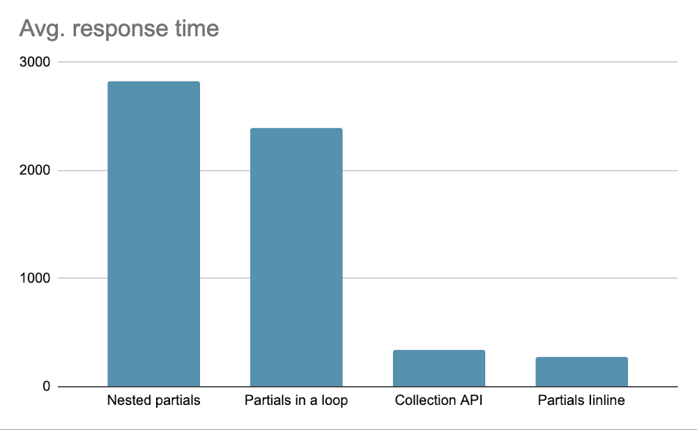
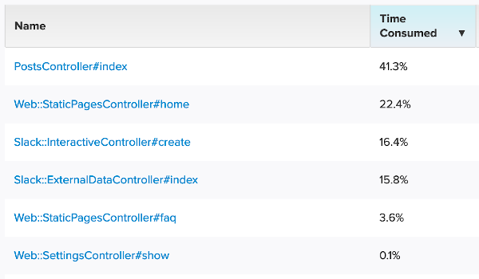
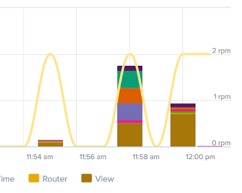
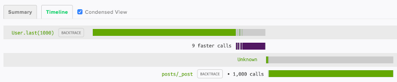

## Ảnh hưởng hiệu suất của việc sử dụng partials trong views ROR
View partials giúp codebase của bạn ko bị lặp lại (DRY) nhưng việc lạm dụng có thể gây ảnh hưởng lớn đến hiệu năng. Ở bài viết này, tôi sẽ mô tả khi nào
bạn nên tránh sử dụng view partials và các thay thế.

### Đo lường tác động đến hiệu suất
Hãy bắt đầu bằng cách kiểm tra xem ứng dụng của bạn có thể chậm hơn bao nhiêu khi chạy trên partials. Tôi đã thử nghiệm trên Ruby 2.7, Rails 6 sử dụng
*Siege*. Ứng dụng được cài đặt môi trường production với Puma server. Chạy ứng dụng dưới local để loại bỏ chi phí về đường truyền mạng. Phần cứng sử dụng
MacBook Pro 15 inch 2.2GHz và 16GB RAM

Code sử dụng để test trong như sau:
```ruby
class PostsController < ApplicationController
  def index
    @posts = Post.order(:created_at).limit(1000)
  end
end
```
Ví dụ trên sử dụng 1000 objects, nhưng sự phóng đại này có mục đích. Sự khác biệt tương đối về hiệu suất sẽ giống nhau nếu kiểm tra với số lượng object nhỏ hơn.
Chúng ta test endpoint này bằng cách sử dụng Siege script:
```bash
siege --time=30s --concurrent=10 http://localhost:3000/posts
```
Tôi đã thử nghiệm bốn trường hợp:
+ Sử dụng partials chi tiết cho từng object
+ Sử dụng collection API
+ Sử dụng collection API với partials được nhúng vào
+ Render data inline

Hãy xem kết qủa cho từng trường hợp:
#### Sử dụng partials chi tiết cho từng object
Chúng tôi sẽ bắt đầu với cách tiếp cận đơn giản nhất để sử dụng partials. Chúng ta chỉ cần đặt partial trong vòng lặp và bạn đã sẵn sàng để bắt đầu:
```bash
app/views/posts/index.html.erb

<% @posts.each do |post| %>
 <%= render 'post', post: post %>
<% end %>

app/views/posts/_post.html.erb

<% @posts.each do |post| %>
 <%= render 'post', post: post %>
<% end %>
```
Đây là kết quả của kiểm tra hiệu suất bằng Siege:
```bash
Transactions: 119 hits
Response time: 2.39 secs
Transaction rate: 4.01 trans/sec
Throughput: 0.23 MB/sec
Successful transactions: 119
Failed transactions: 0
Longest transaction: 3.14
Shortest transaction: 0.65
```
Thời gian phản hồi thay đổi giữa 650ms và 3140ms với mức trung bình là 2390ms. Đây là một hiệu suất không thể chấp nhận được, vì vậy hãy xem cách chúng ta có thể cải thiện nó.

### Sử dụng collection API
Trong ví dụ trước, cho mỗi object, Rails đã phải thực hiện thao tác IO đọc tệp không hiệu quả. Việc truy cập file hệ thống chậm hơn so với việc đọc dữ liệu từ bộ nhớ. Để tăng tốc độ cho endpoint, bạn có thể sử dụng **collection** API cho phương thức **render**. Điều đó sẽ loại bỏ vòng lặp **each** và chỉ thực hiện một thao tác đọc IO.
```ruby
app/views/posts/index.html.erb

  <%= render partial: 'post', collection: @posts, as: :post %>
```
Đây là kết quả khi chạy Siege:
```bash
Transactions: 862 hits
Response time: 0.34 secs
Transaction rate: 28.89 trans/sec
Throughput: 1.57 MB/sec
Successful transactions: 863
Failed transactions: 0
Longest transaction: 0.74
Shortest transaction: 0.24
```
Kết quả này nhanh hơn đáng kể hơn là sử dụng vòng lặp để render partial cho mỗi object. Thời gian phản hồi thay đổi giữa 240ms và 740ms, với mức trung bình là 340ms. Đó đã là một hiệu suất chấp nhận được đối với hầu hết các ứng dụng, nhưng chúng ta có thể làm tốt hơn.
### Sử dụng collection API với partials được nhúng vào
Tôi đã chạy test performance mà phần trên partial dùng với **collection** API và partial khác được render bên trong **_post.html.erb** partial.
```ruby
app/views/posts/_post.html.erb

<h3><%= post.title %></h3>
<%= render 'post_detail', post: post %>

app/views/posts/_post_detail.html.erb

<p><%= post.content %></p>
```
Đây là kết quả:
```bash
Transactions: 98 hits
Response time: 2.83 secs
Transaction rate: 3.36 trans/sec
Throughput: 0.19 MB/sec
Successful transactions: 98
Failed transactions: 0
Longest transaction: 4.13
Shortest transaction: 1.06
```
Thời gian phản hồi thay đổi giữa 1060ms và 4130ms với mức trung bình là 2830ms. Như bạn có thể thấy, nếu bạn sử dụng các subpartial, ngay cả collection API cũng không thể tăng tốc hiệu suất.

### Render data inline
Hãy để tôi chỉ cho bạn ít DRY nhất trong tất cả các lựa chọn. Bạn có thể hiển thị nội tuyến tất cả dữ liệu post mà không cần sử dụng partial:
```ruby
<% @posts.each do |post| %>
 <h3><%= post.title %></h3>
 <p><%= post.content %></p>
<% end %>
```
Đây là kết quả:
```bash
Transactions: 1107 hits
Response time: 0.27 secs
Transaction rate: 37.20 trans/sec
Throughput: 2.02 MB/sec
Successful transactions: 1108
Failed transactions: 0
Longest transaction: 0.41
Shortest transaction: 0.05
```
Thời gian phản hồi nhanh hơn đáng kể so với sử dụng **collection** API. Dưới tải nhỏ hơn, chúng ta có thể trông đợi thời gian phản hồi vào khoảng 50ms, bởi vì test đang được thực hiện dưới tải lớn và thời gian phản hồi khoảng 270ms.

### Hãy so sánh thời gian phản hồi trung bình cho tất cả các phương thức:
Mặc dù ko rõ ràng vì tỉ lệ nhưng partials inline nhanh hơn khoảng 25% hơn collection API


Chúng ta thấy rằng render là lựa chọn có hiệu suất lớn nhất. Hãy xem làm thế nào để nó dễ bảo trì hơn bằng việc sử dụng presenter pattern.

### Presenter Pattern
Để đảm bảo hiệu suất tốt nhất cho endpoint của bạn, bạn phải giới hạn số lượng thao tác đọc tệp chậm sao cho nó là nhỏ nhất. Điều đó có nghĩa là bạn ko sử dụng partial nhưng luôn nhúng HTMl snippet trong cùng file.

Đặt hết toàn bộ logic vào trong một file view dẫn đến khó bảo trì sau này. Bạn có thể cắt logic thành từng phần đặt trong một object dễ thực hiện test bằng cách sử dụng presenter pattern.

Công cụ phổ biến cho presenter trong Rails là **Draper** gem. Tôi không khuyên bạn nên sử dụng nó. Nó nặng và không còn được bảo trì. Thay vào đó, bạn có thể sử dụng presenter class có sẵn là **SimpleDelegator** helper.

Hãy tưởng tượng bạn đang làm việc với templete sau:
```erb
app/views/index.html.erb

  <% @posts.each do |post| %>
   <h3 class="<%= post.featured? ? 'featured' : 'standard' %>"

   <% if post.anonymous? %>
    <p>Anonymous</p>
   <% else %>
    <p>Posted by: <%= post.author %></p>
   <% end %>

   <p><%= post.content %></p>
  <% end %>
```
Hãy để tôi chỉ cho bạn cách cải thiện nó bằng cách sử dụng presenter đơn giản. Bắt đầu với presenter class:
```ruby
app/presenters/post_presenter.rb

class PostPresenter < SimpleDelegator
  def title_class
    if featured?
      "featured"
    else
      "standard"
    end
  end

  def display_author
    if anonymous?
      "Anonymous"
    else
      "Posted by: #{author}"
    end
  end
end
```
Presenter object ko chứa thẻ HTML, nếu bạn render HTML từ Ruby code, bạn phải sử dụng **sanitize** để ngăn ngừa bị tấn công XSS. XSS được liệt kê trong số mười rủi ro [bảo mật ứng dụng OWASP hàng đầu](https://owasp.org/www-project-top-ten/). Cuộc tấn công được thực hiện thành công có thể dẫn đến việc chiếm tài khoản của nạn nhân,thay đổi nội dung trang web của bạn hoặc chuyển hướng người dùng đến các trang web độc hại.

Khi kiểm tra, tôi nhận thấy rằng chạy theo cách thủ công **sanitize** trên một collection lớn rất chậm. Miễn là bạn giữ HTMl trong một template riêng, Rails sẽ bảo vệ tránh khỏi việc bị tấn công XSS một cách hiệu quả hơn.

Thêm phương thức sau vào model:
```ruby
app/models/post.rb

def decorate
  PostPresenter.new(self)
end
```
Bây giờ templete của bạn sẽ trong như thế này:
```erb
<% @posts.each do |post| %>
  <% post = post.decorate %>
  <h3 class="<%= post.featured_class %>">
    <%= post.title %>
  </h3>
  <p><%= post.display_author %></p>

  <p><%= post.content %></p>
<% end %>
```
Bạn có thể đem tất cả logic vào trong presenter class và giữ templete chỉ sự dùng HTML thuần. Nó sẽ giúp việc bảo trì dễ dàng hơn sau này khi ứng dụng của bạn ngày càng lớn và phức tạp.

Nếu bạn đang kế hoạch cho dùng presenter cho nhiều model, bạn có thể đặt logic đến một module để sử dụng lại theo quy ước tên presenter cho từng model:
```ruby
app/concerns/presentable.rb

module Presentable
  def decorate
    "#{self.class}Presenter".constantize.new(self)
  end
end
```

### Phát hiện các partial chậm bằng sử dụng công cụ monitor
Cách tiếp cận được mô tả ở trên không bao giờ là giải pháp nên làm của bạn. Nó chỉ có ý nghĩa đối với các endpoint tắc nghẽn có tác động đến hiệu suất tổng thể của ứng dụng của bạn. Trước tiên, hãy giới hạn kích thước của collection được hiển thị bằng cách thêm phân trang. Chỉ sử dụng kỹ thuật tối ưu hóa được mô tả trên nếu phân trang không áp dụng được.

Hãy xem cách chúng tôi có thể phát hiện endpoint cần được refactor lại. ScoutAPM cung cấp một cách đơn giản để liệt kê các HTTP endpoint được sắp xếp theo lượng thời gian của ứng dụng mà chúng sử dụng:


Bây giờ, bạn có thể phân tích xem endpoint dành phần lớn thời gian xử lý của lớp phản hồi nào.



Nếu lớp View quá chậm, bạn nên đi sâu vào phân tích endpoint Trace

Trên màn hình này, bạn có thể xem partial nào đã được hiển thị bao nhiêu lần. Để cải thiện hiện hiệu năng, bạn có thể viết lại bằng cách sử dùng collection API hoặc inline HTML cùng với presenter class

Ref: https://scoutapm.com/blog/performance-impact-of-using-ruby-on-rails-view-partials
