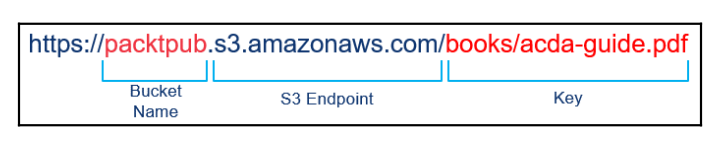

## Tìm hiểu về AWS S3

### Giới thiệu về S3
S3 là một dịch vụ lưu trữ dựa trên nền tảng cloud của Amazon. Nó có khả năng mở rộng cao và giúp bạn dễ dàng truy cập qua internet. Bạn có thể sử dụng S3 để lưu trữ và truy xuất dữ liệu hầu như không giới hạn, bất kỳ lúc nào, từ bất kỳ đâu. Nó cung cấp cho bạn quyền truy cập vào bộ nhớ có khả năng mở rộng cao, đáng tin cậy, hiệu quả và chi phí thấp cơ sở hạ tầng được Amazon sử dụng để điều hành mạng lưới trang web toàn cầu của riêng mình.

S3 được khuyến nghị để lưu trữ nội dung tĩnh như tệp đồ họa, tài liệu, nhật ký tệp, âm thanh, video và tệp nén. Hầu như bất kỳ loại dữ liệu nào ở bất kỳ định dạng tệp nào đều có thể được lưu trữ trên S3. Kích thước object được phép trong S3 là 0 byte đến 5 TB. Các object trong S3 được lưu trữ trong một bucket. Bucket là một đơn vị logic trong S3 giống như một thư mục. Bucket được tạo ở cấp cơ sở trong S3 với tên duy nhất trên toàn cầu. Bạn có thể lưu trữ các object và cả các thư mục bên trong bucket. Bạn có thể lưu trữ tùy ý bao nhiêu object trong một bucket. Có giới hạn mềm là mỗi tài khoản chỉ có thể tạo tối đa 100 bucket


Phần sau đây mô tả các khái niệm và thuật ngữ được sử dụng trong S3:

+ **Buckets**: là một đơn vị logic trong S3, giống như một thư mục. Bucket là nơi mà bạn có thể lưu trữ các object  và cả các thư mục. Bucket tạo tại root level trong S3 với một tên duy nhất trên toàn cầu. Không giới hạn số lượng object lưu trong mọt bucket. Ví dụ: nếu bạn lưu trữ một object có tên `books/acda.pdf` bên trong bucket packtpub, sau đó nó có thể truy cập được bằng cách sử dụng URL https://packtpub.s3.amazonaws.com/books/acda.pdf. Bucket thường được sử dụng để tổ chức các object trong S3. Chúng được liên kết bằng tài khoản AWS chịu trách nhiệm lưu trữ và truy xuất dữ liệu trên bucket. Tài khoản sở hữu bucket sẽ bị tính phí chuyển dữ liệu. Bucket đóng một vai trò quan trọng trong việc kiểm soát truy cập và mở đường cho việc tạo báo cáo sử dụng trên S3. Bucket có thể được tạo trong một khu vực cụ thể. Bạn có thể cho phép sử dựng versioning trên một bucket. Nếu versioning được bật trên bucket, nó duy trì một ID version duy nhất đối với từng object được lưu trữ trong đó.

+ **Object**: là các thực thể cơ bản được lưu trữ trong S3. Mỗi object bao gồm dữ liệu, metadata và unique identifier trên toàn cầu. Metadata được lưu trữ trong một tập hợp các key - value; ví dụ: Date Last Modified, Content Type, và Content-Length. Có thể có hai loại metadata được liên kết với một object — metadata do hệ thống xác định và metadata do người dùng xác định. Một object được xác định bằng một khóa duy nhất (tên) trong bucket và một ID version, nếu tính năng version được bật trên bucket.

+ **Keys**: là tên được gán cho một object. Nó là một mã định danh duy nhất hoặc đặt tên cho mỗi object trong một bucket. Mỗi object trong một bucket chỉ có một khóa liên quan đến nó. Sự kết hợp của một bucket, một key và ID verson tương ứng xác định duy nhất một object trong một bucket. Mỗi object trong một bucket có một địa chỉ duy nhất để truy cập nó thông qua một endpoint. URL địa chỉ bao gồm tên bucket, key, và version, nếu versioning được bật trên bucket. Ví dụ, xem xét `https://packtpub.s3.amazonaws.com/books/acda.pdf`. Trong ví dụ này, `packtpub` là tên của bucket và `books/acda.pdf` là key


+ **Region**: là khu vực địa lý nơi Amazon S3 lưu trữ dựa trên sở thích của người dùng. Người dùng có thể chọn một khu vực trong khi tạo bucket, dựa trên yêu cầu. Tốt nhất, một bucket nên được tạo trong khu vực địa lý gần nhất nơi bucket cần được truy cập. Việc chọn khu vực gần nhất trong khi tạo bucket sẽ tối ưu hóa độ trễ, trong khi truy cập vào bucket làm giảm chi phí và tuân thủ mọi quy định các yêu cầu mà một tổ chức có thể có. Khi bạn tạo một object trong một vùng, nó sẽ được lưu trữ trong cùng một vùng, trừ khi bạn sao chép rõ ràng nó sang bất kỳ khu vực nào khác.

+ **S3 data consistency model**: Amazon cung cấp hai loại mô hình consitency cho S3 dữ liệu khi bạn thực hiện các hoạt động đọc và ghi: `read-after-write consistency` và `eventual consistency`. Amazon cung cấp `read-after-write consistency` cho PUTS của một object mới. Điều này có nghĩa là nếu bạn tạo một object mới trong S3, bạn có thể đọc nó ngay lập tức. Amazon cung cấp `eventual consistency` cho các hoạt động ghi đè PUTS và DELETES. Điều này có nghĩa là phải mất vài giây trước khi các thay đổi được phản ánh trong S3 khi bạn ghi đè hoặc xóa một object hiện có trong S3.

Amazon sao chép dữ liệu trên toàn khu vực trong nhiều máy chủ đặt bên trong các trung tâm dữ liệu. Quá trình sao chép này cung cấp tính sẵn sàng cao cho dữ liệu. Khi bạn tạo một object mới trong S3, dữ liệu được lưu trong S3; tuy nhiên, thay đổi này phải replicate trên các khu vực Amazon S3. Việc sao chép có thể mất một thời gian và bạn có thể quan sát thấy hành vi sau:
+ Sau khi bạn tạo một object mới trong S3, Amazon lập tức liệt kê object key trong bucket và các object key mới có thể không xuất hiện trong danh sách.
+ Khi bạn thay thế một object hiện có và ngay lập tức cố gắng đọc object, Amazon có thể trả lại dữ liệu cũ cho đến khi dữ liệu được replicate hoàn toàn.
+ Khi bạn xóa một object và ngay lập tức cố gắng đọc nó, Amazon có thể đọc dữ liệu của object đã xóa cho đến khi việc xóa được replicate hoàn toàn.
+ Khi bạn xóa một object trong một bucket và ngay lập tức liệt kê nội dung của bucket, bạn vẫn có thể thấy object đã xóa trong nội dung của bucket cho đến khi việc xóa được replicate hoàn toàn.

### Bucket restrictions và limitations

Bucket policy bao gồm các yếu tố sau:
+ Bạn có thể tạo bucket bằng dashboard S3, API hoặc CLI
+ Amazon áp đặt giới hạn mềm là 100 bucket đối với tài khoản AWS. Bạn có thể tăng giới hạn mềm này bằng cách đưa ra yêu cầu hỗ trợ với Amazon.
+ Khi bạn tạo một bucket, nó được liên kết với tài khoản AWS và người dùng bạn đã sử dụng để tạo nó. Không thể chuyển quyền sở hữu bucket cho một tài khoản AWS khác hoặc một người dùng khác trong cùng một tài khoản AWS
+ Không có giới hạn về số lượng object có thể được tạo trong một bucket.
+ Một bucket được tạo root level trong S3; bạn không thể tạo một bucket bên trong một bucket.
+ Nếu bạn sử dụng ứng dụng tự động tạo bucket, hãy đảm bảo rằng ứng dụng chọn một tên bucket khác nếu tên bucket được tạo bởi ứng dụng đã tồn tại

### Bucket access control
Mỗi bucket trong S3 được liên kết với một access control policy, policy này điều chỉnh cách các object được tạo, xóa và liệt kê trong bucket.

Khi bạn tạo tài nguyên S3, tất cả tài nguyên S3, bao gồm bucket, object, life cycle policy và static website, là riêng tư theo mặc định. Chỉ chủ sở hữu tài nguyên đã tạo tài nguyên có thể truy cập tài nguyên đó. Sau khi tạo tài nguyên, chủ sở hữu tài nguyên có thể tùy chọn cấp quyền cho người dùng khác bằng cách sử dụng access control policy.

Có hai loại access control policy:
+ Resource-based policies
+ User policies

Access control policy mà bạn liên kết với bucket và object được gọi là **resource-based policies**. Bucket policy và access-control lists (ACL) là những ví dụ về resource-based policies. Policy truy cập mà bạn liên kết với người dùng được gọi là user policies. Bạn có thể sử dụng resource-based policy or a user policy để kiểm soát quyền truy cập vào tài nguyên S3 của bạn.

### Bucket policy
Bucket policy thường bao gồm các yếu tố sau:
+ **Resource**: Điều này cho biết các tài nguyên của Amazon S3, chẳng hạn như bucket và object. Trong khi tạo policy, bạn có thể chỉ định ARN để cho phép hoặc từ chối quyền đối với tài nguyên đó
+ **Action**: Điều này cho biết một hoặc nhiều hành động được phép hoặc ko được phép. Ví dụ: s3: GetObject chỉ định quyền đọc dữ liệu đối tượng. Tương tự, s3: ListBucket chỉ định quyền liệt kê object trong bucket.
+ **Effect**:  Điều này chỉ định loại hành động: cho phép hoặc từ chối quyền truy cập. Nếu quyền không được cấp rõ ràng trên tài nguyên, theo mặc định, quyền truy cập là từ chối. Khi bạn từ chối quyền truy cập một cách rõ ràng, điều đó đảm bảo rằng người dùng không thể truy cập tài nguyên, ngay cả khi policy khác cấp quyền truy cập
+ **Principal**: Điều này cho biết tài khoản / người dùng được phép hoặc bị từ chối truy cập các nguồn được đề cập trong policy. Trong user policy, bạn có thể không cần chỉ định hiệu trưởng. User policy hoàn toàn áp dụng cho người dùng được liên kết.
+ **Sid**: Đây là một số nhận dạng tùy chọn được gọi là ID statement, là được chỉ định cho policy statement. Giá trị Sid phải là duy nhất trong policy statement. Sau đây là một ví dụ về bucket policy. Các policy ví dụ cho phép người dùng Heramb ba quyền sau trên bucket có tên packtpubs:
   + s3:GetBucketLocation
   + s3:ListBucket s3:GetObject

Trong policy statement, ID tài khoản phải được thay thế bằng số tài khoản AWS:
```json
{
  "Version": "2012-10-17",
  "Statement": [
    {
      "Sid": "Statement1",
      "Effect": "Allow", "Principal": {
        "AWS": "arn:aws:iam::Account-ID:user/Heramb"
      },
      "Action": [ "s3:GetBucketLocation", "s3:ListBucket", "s3:GetObject"],
      "Resource": [ "arn:aws:s3:::packtpubs"]
    }
  ]
}
```
Trong cùng một policy, nếu bạn thay đổi hiệu lực từ cho phép thành từ chối, nó sẽ từ chối một cách rõ ràng người dùng Heramb truy cập vào bucket packtpubs để thực hiện tập hợp các hành động cụ thể được đề cập trong policy statement.
### User policies
Access policy được liên kết với người dùng hoặc bucket. Không giống như với bucket policy, bạn không cần chỉ định chính mình user policy. Một policy hoàn toàn được áp dụng cho người dùng được liên kết với nó.


Ví dụ về user policy như sau:

```json
{
  "Version":"2012-10-17",
  "Statement":[
    {
      "Effect":"Allow", "Action":[
        "s3:ListAllMyBuckets"
      ],
      "Resource":"arn:aws:s3:::*"
    },

    {
      "Effect":"Allow", "Action":[
        "s3:ListBucket", "s3:GetBucketLocation"
      ],
      "Resource":"arn:aws:s3:::packtpubs"
    },

    {
      "Effect":"Allow", "Action":[
        "s3:PutObject", "s3:GetObject", "s3:DeleteObject"
      ],
      "Resource":"arn:aws:s3:::packtpubs/*"
    }
  ]
}
```


Có ba phần trong ví dụ về user policy:
+ Phần đầu tiên mô tả quyền liệt kê tất cả các bucket bằng cách sử dụng hành động ListAllMyBuckets dựa trên `arn:aws:s3:::*`, biểu thị tất cả tài nguyên trong S3 cho tài khoản.
+ Phần thứ hai mô tả ListBucket và GetBucketLocation quyền trên bucket packtpubs.
+ Phần thứ ba mô tả các quyền để tạo, đọc và xóa các object trong bucket packtpubs.


Khi  user policy được tạo, policy đó có thể được đính kèm với người dùng hoặc một bucket để cấp cho họ quyền truy cập tương ứng được chỉ định trong bucket.
