## Những Linux command cơ bản mà developer nên ~~phải~~ biết
GUI là công cụ khá tiếp cận, làm quen và sử dụng khi sử dụng window. Nhiều tác vụ trên Linux cũng có thể hoàn thành bằng việc sử dụng giao diện GUI, nhưng công cụ mạnh nhất của Linux vẫn là command line. Bằng command line thay vì sử dụng chuột và click thì ta chỉ việc gõ câu lệnh trên terminal, việc này giúp bạn ~~trông ngầu hơn~~ tiết kiệm rất nhiều thời thời gian, thử tưởng tượng mỗi lần bạn bỏ tay ra di chuột và click so với tốc độ đánh máy sẽ chậm hơn 2~3s, một ngày có thể thực hiện nhiều lần thao tác và nhân với số năm đi code của bạn thì command có thể giúp bạn tiết kiệm nhiều thời gian, hơn nữa điểm mạnh của command line mà GUI ko có đó là khả năng automation bằng  cách viết vào và thực thi bằng script.

Dưới đây là những command cơ bản có thể có ích đối với người mới sử dụng Linux

### 1. grep
```bash
$ grep "string" file
```

Câu lệnh `grep` cho phép tìm kiếm và lọc thông tin theo mẫu cho trước, `grep` chỉ in
ra những dòng có thông tin trùng với mẫu cần tìm kiếm

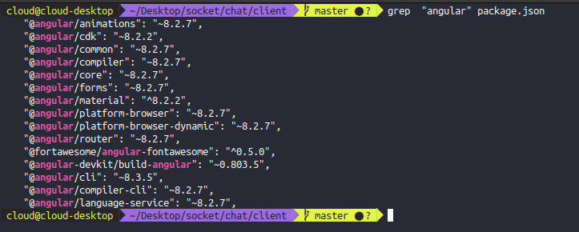

Có thể sử dụng option -i để tránh trường hợp case-sensitive ví dụ như trường hợp `Angular`, `angUlar`,... sẽ đều match

```bash
$ grep -i "Angular" file
```
Ta có thể sử dụng option `-c` để đếm xem bao nhiều dòng khớp với nội dung cần tìm kiếm

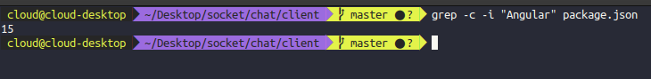

Một option hữu ích khác khi cần tìm kiếm thông tin của file là `-A` và `B` nghĩa là above - bên trên, below bên dưới, số dòng được chỉ định bên trên và bên dưới kể từ dòng có kết quả trùng với patterm cần được tìm kiếm cũng được in ra theo, khá hữu ích trong trường hợp cần tìm thông tin về log mà bạn chỉ grep mỗi từ Error

```bash
$ grep -A number -B number "Error" file
```


### 2. ls
```bash
$ ls
```
`ls` sẽ in ra toàn bộ danh sách các file trong thư mục hiện tại, có thể chỉ định tên thư mục, trong trường hợp chỉ định tên file thay vì thư mục thì `ls` sẽ in ra thông tin của mình file đó.

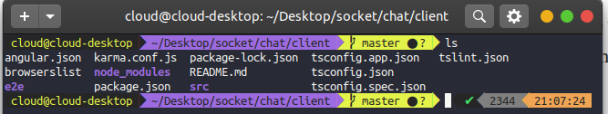

Ở đây file và folder được hiện thị bằng màu sắc khác nhau, file là màu trắng còn folder có màu tím.
Để hiện cả các file ẩn ta có thể sử dụng option `-a`, hiện chi tiết ta có thể sử dụng options `-lh` hoặc dùng command `ll` cho ngắn

Các thông tin được hiển thị ở trên bao gồm permision, owner, size, thời gian tạo và tên của file hay thư mục.

### 3. pwd
```bash
$ pwd
```
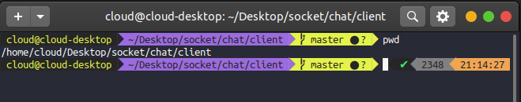
Câu lệnh `pwd` dùng để in ra đường dẫn của thư mục đang làm việc hiện tại. Thông tin được hiện thị ra là đường dẫn tuyệt đối của thư mục, mặc định `pwd` sẽ bỏ qua symlinks

### 4. cat
```bash
$ cat file
```
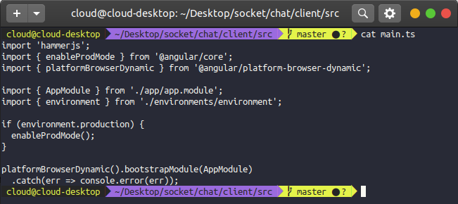
`cat` thường được sử dụng nhiều nhất là để đọc nội dung của file, bạn cũng có thể làm điều này bằng việc sử dụng các editor như `vi`, `nano` hay command như `less`, nhưng trong trường hợp chỉ muốn xem nội dung thì gần như `cat` là công cụ thuận tiện nhất để làm điều này.

Nội dung đầu ra của câu lệnh `cat` có thể được sử dụng với toán tử redirect để ghi vào file mới
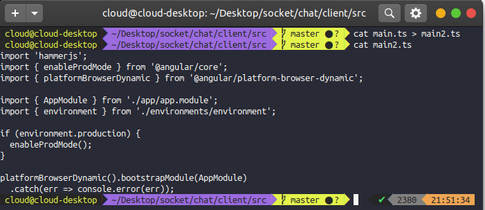

### 5. echo

```bash
$ echo "some text"
```
Câu lệnh `echo` được sử dụng để in ra màn hình nội dung được truyền vào như là một argument. Câu lệnh này thường được sử dụng nhiều trong bash script để in ra ngoài màn hình status mà người viết muốn đưa ra. Trong nhiều trường hợp có thể sử dụng `echo` để xem biến môi trường của Linux
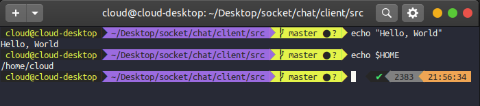

### 6. touch

```bash
$ touch file_name
```
Câu lệnh `toch` được sử dụng để tạo file rỗng. Câu lệnh được sử dụng khi người dùng ko có nội dung nào cần được lưu trữ vào file tại thời điểm tạo, đây là điểm khác biệt giữa `touch` và `cat`
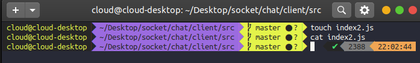
Ở ví dụ trên, file `index2.js` được tạo bằng câu lệnh `touch`, do ko có nội dung nên câu lệnh `cat` ko trả lại nội dung gì.

### 7. mkdir

```bash
$ mkdir folder_name
```
`mkdir` là câu lệnh được sử dụng để tạo thư mục mới từ vị trí thư mục hiên tại, thay vì dùng GUI và click để tạo thư mục thì bạn có thể sử dụng câu lệnh này. Trong trường hợp bạn tạo sub-folder mà folder cha không tồn tại thì câu lệnh sẽ thông báo lỗi, có thể sử dụng option `-p` để đảm bảo folder cha sẽ được tạo nếu không tồn tại
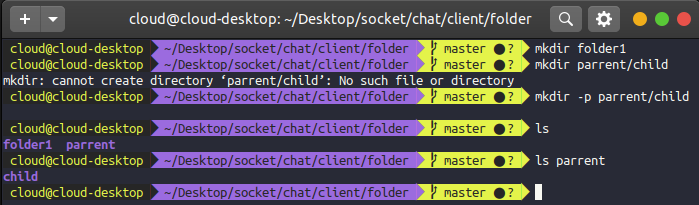

### 8. rm
```bash
$ rm some_file
```
`rm` là câu lệnh được sử dụng để xóa file. Mặc định thì `rm` sẽ không thực hiện xóa thư mục mà sẽ thông báo lỗi, để thực hiện xóa toàn bộ thư mục và file bên trong thì ta cần truyền thêm option `-rf`
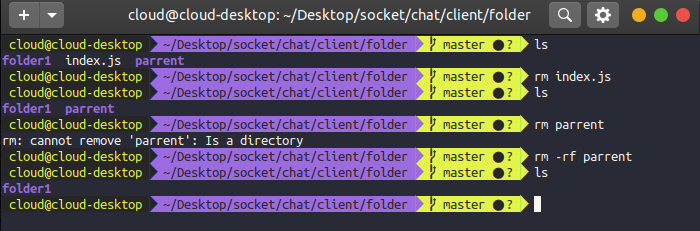

### 9. tail
```bash
$ tail some_file
```
`tail` được sử dụng để đọc và cho ouput phần cuối của file, đúng như tên gọi của nó, mặc định `tail` sẽ in ra 10 dòng cuối cùng, ta có thể sử dụng option `-n` để in ra số dòng như mong muốn.
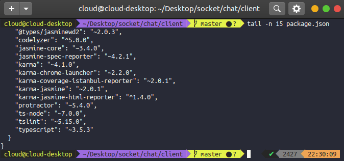
Ta có thể sử dụng option `-f` để giữ và ghi thêm vào sau kết quả trước khi nội dung file tăng lên, cách này đặc biệt hiệu quả khi cần xem nội dung file log trực tiếp của server hay của system thời gian thực, có thể kết hợp pipe thêm `grep` để lọc dữ liệu rất thích hợp khi debug
```bash
# Log real time system log
$ sudo tail -f /var/log/syslog
```
### 10. mv
```bash
$ mv some_file destination
```
Câu lệnh `mv` được sử dụng để di chuyển file hay folder đến một folder mới. Câu lệnh `mv` hỗ trợ di chuyển một file, nhiều file hay cả thư mục.
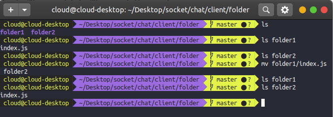

Ta có thể sử dụng `mv` để đổi tên file bằng cách giữ nguyên folder hiện tại của file nhưng đổi tên file sang tên mới

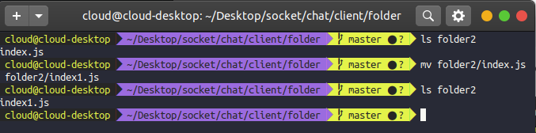
