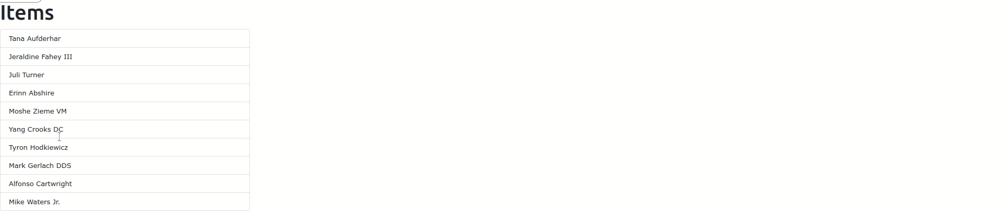

# Tạo sort list với jquery-ui và ranked-model



Để tạo một trang có thể drag drop và sắp xếp lại một danh sách ở nội dung bài viết này sẽ sử dụng với Rails 6 sử dụng gem `ranked-model` và `jquery-ui`


## Setup
Tạo project mới với Rails

```
rails new project_name
```

Sau khi khởi tạo project, ta thêm gem `ranked-model` bằng cách thêm dòng xong vào `Gemfile`

```
gem "ranked-model"
```

Sau đó chạy `bundle install` để cài đặt

Rails 6 ko sử dụng `Sproket` để quản lý asset thay vào đó sử dụng `webpacker` để quản lý javascript. Thay vì sử dụng package như là một gem với webpacker ta sẽ sử dụng npm để import các thư viện. Trong trường hợp này ta cần cài đặt và sử dụng 2 thư viện là `jquery` và `jquery-ui`. Để cài đặt `jquery-ui` ta làm như sau:

+ Cài đặt package `jquery-ui-dist`
```
yarn add jquery-ui-dist
```
+ Resolve alias config với webpack, trong trường hợp này là `jquery` và `jquery-ui`. Ta sửa nội dung file `config/webpack/environment.js` như sau:
```javascript
const webpack = require('webpack')
environment.plugins.prepend('Provide',
  new webpack.ProvidePlugin({
    $: 'jquery',
    jQuery: 'jquery'
  })
);

const aliasConfig = {
    'jquery': 'jquery-ui-dist/external/jquery/jquery.js',
    'jquery-ui': 'jquery-ui-dist/jquery-ui.js'
};

environment.config.set('resolve.alias', aliasConfig);

module.exports = environment
```
+ Restart lại rails server
+ Require dependency trong file `app/javascript/packs/application.js`:

```javascript
global.$ = require("jquery")
require("jquery") // Don't really need to require this...
require("jquery-ui")
```

## Implement
Như ở trên ta đã setup và cài đặt xong các thư viện cần thiết. Để demo đơn giản thì ta dùng lệnh `scaffold` của rails để tạo đầy đủ file cần thiết bao gồm từ routes, model, controller, view cho một resource.

```bash
rails g scaffold Item name:string order:integer
```
Lệnh trên sẽ generate ra resource Item, có 2 thuộc tính là name và order dùng để lưu giá trị để sắp xếp các Item.

Trỏ lại root path về danh sách Item như bằng cách config file `routes.rb`:
```ruby
Rails.application.routes.draw do
  root "items#index"
  resources :items
end
```
Sau khi chạy `rails s` ta có thể dùng browser để truy cập vào url `localhost:3000` để xem danh sách các item. Để fake dữ liệu ta dùng gem `faker` và chạy script trong console của rails:

```ruby
10.times { Item.create(name: Faker::Name.name) }
```

À mà khi làm điều này ta cần setup `ranked-model` cho model Item. Setup khá đơn giản, ta chỉ cần thêm khai báo trong model Item như sau:

```ruby
class Item < ApplicationRecord
  include RankedModel
  ranks :order
end
```

Đầu tiên ta include `RankedModel` vào để sử dụng được các method của `ranked-model`. Tiếp theo ta dùng macro `ranks`, sau khi dùng macro này, mỗi khi ta thực hiện việc thêm sửa xóa thì gem sẽ tự động maintain dựa trên column order của các item trong database mà ta ko cần quan tâm gì nhiều.

Để sắp xếp dữ liệu trả về theo order ta với column order ta sửa lại trong controller như sau:
```ruby
# app/controllers/items_controller.rb

  def index
    @items = Item.all.rank(:order)
  end
```

Tiếp đến ta sửa lại view ui trong file `app/views/items/index.html.erb` thành list danh sách item:
```erb
<h1>Items</h1>

<ul id="sortable" class="list-group w-25">
  <% @items.each do |item| %>
      <li class="list-group-item" id="<%= item.id %>">
        <%= item.name %>
      </li>
  <% end %>
</ul>

```
Như vậy là đã có 1 last, ở element `ul` thì ta thêm id để dùng với jquery sortable, mỗi thẻ `li` ta gán thêm giá trị của id của item để ghép url để update item sau này.


Tiếp đến chỉ việc thực hiện sort và update lại order của item mỗi khi sort. Ta sử dụng sortable của jquery như sau

```javascript
$(window).on("load", () => {
  $("#sortable").sortable({
    update: function(event, ui) {
      $.ajax({
        method: "PUT",
        url: "/items/" + $(ui.item).attr("id"),
        dataType: "json",
        data: { item: { order_position: ui.item.index() }}
      })
    }
  });
})
```

Ta gọi `$(element).sortable()` để khởi tạo sortable của `jquery-ui`. Sau đó pass vào object parameter, trong này có key `update` có giá trị là một function, mỗi khi list được update thì function này được gọi, trong này có xử lý phần update lại order với server. Ta tạo mỗi ajax request update như bình thường, chỉ trừ việc update thằng vào giá trị order thay vì trùyền parameter `order` ta truyền lên với key là `order_position`, khi nhận giá trị này `ranked-model` sẽ tính toán lại gía trị mới cho order và update lại item.
