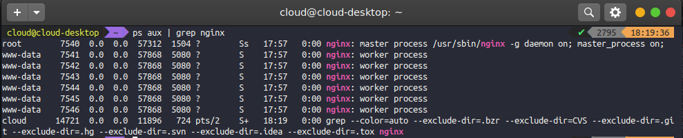
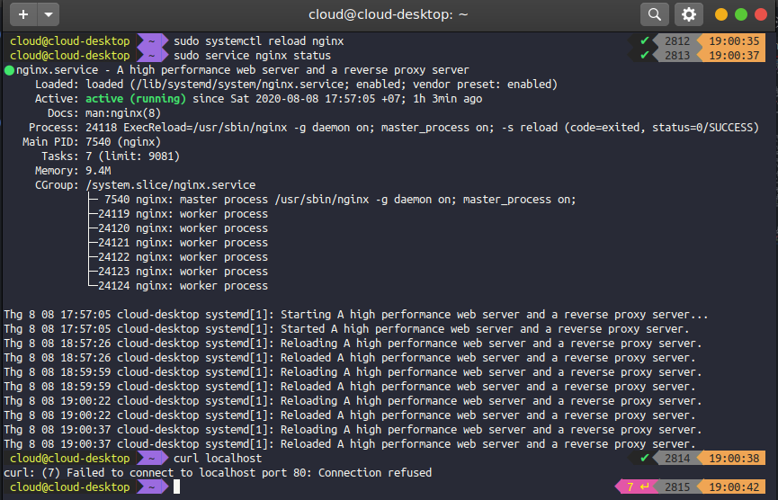
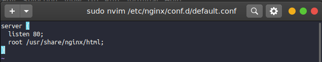
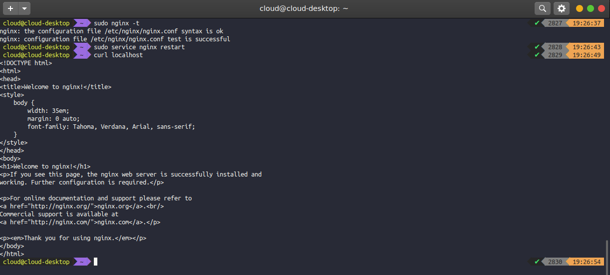
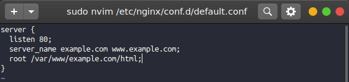
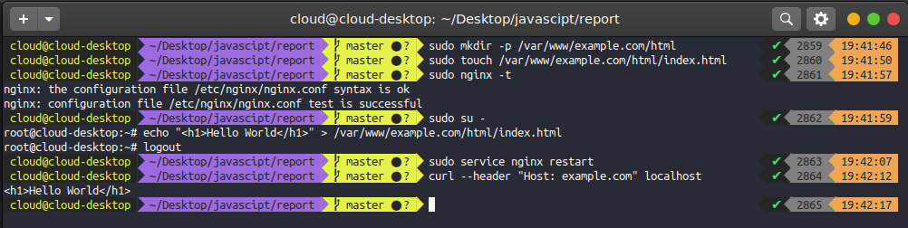

# Làm quen với NGNIX
## 1. Giới thiệu về NGINX
NGINX là một phần mềm viết vào năm 1999 và mã nguồn mở vào năm 2004 bởi Igor Sysoev. Ban đầu ngĩn được viết để giải quyết vấn đề [C10K problem](https://en.wikipedia.org/wiki/C10k_problem) vào thời điểm đó khi các web server gặp khó khăn trong việc xử lý số lượng request lớn tại cùng 1 thời điểm (10K). Sau thời điểm được open-source, NGINX tiếp tục được phát triển bới cộng đồng và công ty NGINX được thành lập và bản NGINX PLUS được phát triển để thương mại với nhiều [tính năng](https://www.nginx.com/products/nginx/#compare-versions) hơn

Về cơ bản NGINX được sử dụng mới những mục đích chính sau:
+ Sử dụng để làm web server
+ Sử dụng làm reverse proxy
+ Sử dụng làm load balancer

So sánh NGINX và Apache
| NGINX      | Apache |
| :---        |    :----:   |
| Sử dụng các lệnh chỉ thị để cấu hình  | Sử dụng các lệnh chỉ thị để cấu hình |
|  Chỉ sử dụng 1 process với nhiều worker  | Chạy nhiều process     |
|Hỗ trợ động modules bên thứ ba|Hỗ trợ động modules bên thứ ba|
|Performance tương đương với Apache khi dùng nội dung động (dynamic content)|Performance tương đương với NGINX khi dùng nội dung động (dynamic content)|
|Performance tốt hơn Apache khi dùng đối vời file tĩnh|Performance thấp hơn NGINX khi dùng đối vời file tĩnh|

## 2. Cấu hình mặc định của NGINX
Cấu hình mặc định của NGINX được cài đặt bở file lưu trữ trong thư mực `/etc/nginx/nginx.conf`:
```conf
user www-data;
worker_processes auto;
pid /run/nginx.pid;
include /etc/nginx/modules-enabled/*.conf;

events {
	worker_connections 768;
}

http {
	sendfile on;
	tcp_nopush on;
	tcp_nodelay on;
	keepalive_timeout 65;
	types_hash_max_size 2048;

        include /etc/nginx/mime.types;
	default_type application/octet-stream;

        ssl_protocols TLSv1 TLSv1.1 TLSv1.2 TLSv1.3;
	ssl_prefer_server_ciphers on;

        access_log /var/log/nginx/access.log;
	error_log /var/log/nginx/error.log;

	include /etc/nginx/conf.d/*.conf;
	include /etc/nginx/sites-enabled/*;
}
```
NGINX sử dụng các chỉ thị (directive) để thiết lập giá trị các thuộc tính của cấu hình, làm việc với NGINX nghĩa là phải cấu hình server NGINX chạy đúng với nhu cầu sử dụng thực tế. Dưới đây là một số directive cấu hình mặc định:
+ `user`: mỗi khi một một tiến trình được khởi chạy thì đều được sở hữu và quản lý bởi `user` nào đó, trong trường hợp này woker của nó, và user mặc định để chạy các tiến trình này là `www-data`


+ `worker_processes` là số lượng woker cùng chạy đồng thời được chỉ định, khi khởi động nginx service thì số woker được chỉ định cũng được khởi tạo theo, giá trị mặc định ở đây là auto, số lượng woker sẽ tự động sinh ra theo só core của cpu, device trong trường hợp trên cpu gồm 6 core nên có 6 woker process được sinh ra
+ `pid`: chỉ định nơi lưu giá trị process master id của nginx
```bash
cloud@cloud-desktop  ~  cat /run/nginx.pid                    ✔  2796  18:23:49
7540
```
+ `events`: là một context directive, chỉ định các cấu hình liên quan đến kết nối xử lý, nếu thiếu context này sẽ ko thể khởi chạy được NGINX
+ `worker_connections`: chỉ định số lượng kết đối đồng thời tại một thời điểm tối đa mà một woker có thể xử lý.
+ `http`: context block chứa các directive cho việc xử lý các request http
+ `include`: cho phép tự động thêm các file cấu hình khác vào, mục đích để chia nhỏ các file cấu hình cho các mục đích khác nhau để dễ quản lý và tăng tính dễ đọc
+ `default_type`: định nghĩa kiểu MINE cho response, trong trường hợp này các type được định nghĩa trong file `/etc/nginx/mime.types` được map vào trước đó, kiểu dữ liệu mặc định sẽ map với giá trị được định nghĩa trong file này, trong trường hợp này gíá trị MINE type mặc định là `application/octet-stream` được định nghĩa trong file mines.types:
```
types {
  ....
  application/octet-stream              bin exe dll;
  application/octet-stream              deb;
  application/octet-stream              dmg;
  application/octet-stream              iso img;
  application/octet-stream              msi msp msm;
  ...
}
```
+ `access_log`, `error_log`: chỉ lịch nới lưu trữ access và error log tương ứng
+ `keepalive_timeout`: thời gian giữ connection  để đợi response từ server
+ `tcp_nopush`: chỉ định dùng hoặc không dùng `TCP_NOPUSH` socket
+ `tcp_nodelay`: chỉ định dùng hoặc ko dùng `TCP_NODELAY` option, option được sử dụng khi chuyển sang trạng thái keep-alive
## 3. Cấu hình server NGINX đơn giản để sử dụng đối với nội dung tĩnh (static content)
Trước hết ta sẽ xóa cấu hình file mặc định của NGINX, trong 2 folder là `/etc/nginx/conf.d/default.conf` hoặc `/etc/nginx/sites-enables/default`. Sau đó khở động lại nginx như sau:

+ Bước đầu tiền cần làm là tạo file cấu hình cho nginx, trường hợp này ta sẽ tạo file `/etc/nginx/conf.d/default.conf` sau đó cấu hình đơn giản như sau:


Ở trên ta dùng `server` directive để khai báo content tạo cấu hình server ảo, tiếp đến sử dụng `listen` directive trong context `server` để chỉ định port mà server sẽ tiếp nhận request, directive này cho phép chỉnh định cụ thể cả ip lẫn port nhưng trường hợp này chỉ cài đặt mình gíá trị cho port. `root` dùng để chỉ định thư mục root cho mỗi request. Để test lại cấu hình ta chạy:

Trường hợp trên ta vừa cấu hình lại như cấu hình mặc định của nginx. Bấy giờ ta sẽ cấu hình lại để nginx trả content từ folder và host là `example.com`, ta cấu hình lại như sau:


Phía trên ta có sử dụng `server_name` directive, nó cho phép ta tạo danh sách các server, server đâu tiên sẽ trở thành mặc định, trong trường hợp này server mặc định là `example.com`, cho phép xử lý với header có thêm giá trị `Host`

Tiếp đó ta tạo thư mục tương ứng là `/var/www/example.com/html`, tạo file `index.html`
sau đó khởi động lại NGINX thì kết quả như sau:


