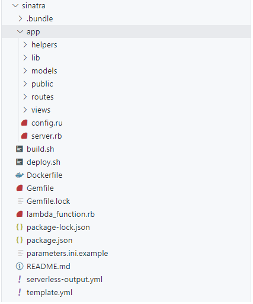

# Ruby deployment with lambda
Lambda là một service của AWS cung cấp cho người dùng giải pháp cho người dùng triển khai dịch vụ của mình nhanh mà ko cần tối quan tâm gì
đến hệ thống, quản lý infra. Cơ chế tính cost của lambda cũng dựa trên số lần request và lương resource provision để chạy lambda, nên trong nhiều
trường hợp sử dụng lambda sẽ tối ứu hóa chi phí hơn so với sử dụng các server liên tục để serve các request


Nội dung bài viết này sẽ hướng dẫn setup 1 web application đơn giản sử dụng Ruby và deploy trên lambda

## Các công cụ cần sử dụng

Trước khi bắt đầu setup cần cài đặt các công cụ sau:
+ Ruby bản 2.5.1 (hoặc cao hơn thì tùy, nhưng 2.5.1 là phiên bản thấp nhất mà lambda hỗ trợ)
+ Docker
+ [SAM](https://docs.aws.amazon.com/serverless-application-model/latest/developerguide/serverless-sam-cli-install.html) CLI
+ AWS cli
+ MySQL

## Setup
Cấu trúc thư mục trông như sau:


Trước hết bắt đầu với Gemfile ta cần cài các dependency:

```ruby
# frozen_string_literal: true

source "https://rubygems.org"

gem "sinatra"
gem "sinatra-contrib"
gem "activerecord", require: "active_record"
gem "mysql2"
```

Bao gồm `sinatra` là thư viện chính, và `sinatra-contrib` để mở rộng, `activerecord` để hỗ trợ query đến database và trường hợp này ta sử dụng MySQL nên
cần sử dụng `mysql2` làm adapter.

Vì sử dụng pattern MVC nhưng hơi khác rails một chút, phần sử lý logic được đặt trong controller của rails sẽ được định nghĩa và đặt dưới folder `routes`,
public content sẽ được đặt trong folder `public`, ngoài ra còn `models`, `views`, `helpers`.

Dưới mỗi file của model hay routes ta sẽ cần 1 file `init.rb` để tự động require tất cả file dưới folder. Để được như vậy ta viết một module nhỏ dưới folder
`sinatra/app/lib/file_unity.rb`

```ruby
module FileUnity
  def directory_file_required(extenstion)
    current_dir = File.dirname(caller_locations.first.path)
    Dir.chdir(current_dir)
    files = Dir["**.#{extenstion}"]
    file_caller = File.basename(caller_locations.first.path)
    files.reject! { |file| file == file_caller }
    files.each do |file|
      require "#{current_dir}/#{file}"
    end
  end
end
```
`directory_file_required` cho phép truyền vào parameter là 1 file extension, cho phép tự động require tất cả các file với extension ở folder hiện tại.
Để có thể recursive require nếu có nested folder thì cần sửa lại để mở rộng thêm. Nội dung mỗi file init như sau:

```ruby
# sinatra/app/models/init.rb
require_relative "../lib/file_unity"
include FileUnity

ActiveRecord::Base.logger = Logger.new(STDOUT)

ActiveRecord::Base.establish_connection(
  adapter:  "mysql2",
  host:     ENV["DBHost"],
  username: ENV["DBUser"],
  password: ENV["DBPassword"],
  database: ENV["DBName"],
  timeout: 10
)

directory_file_required("rb")
```

Ở đây ta cần query log nên setup logger cho active record `ActiveRecord::Base.logger = Logger.new(STDOUT)`. Ngoài ra để kết nối với database ta cần
khai báo thông tin connection, thông tin này đều được đặt trong các biến môi trường env

```ruby
# sinatra/app/routes/init.rb
require_relative "../lib/file_unity"
include FileUnity

before do
  if !request.body.read.empty? && request.body.size > 0
    request.body.rewind
    @params = Sinatra::IndifferentHash.new
    @params.merge!(JSON.parse(request.body.read))
  end
end

directory_file_required("rb")

not_found do
  halt 200
end
```

Trước mỗi request, ta check nếu body của request là empty thì ta merge một default body vào request đó. Bên dưới ta define path `not_found` của sinatra
sẽ trả về status 200 và nội dung rỗng.

Ở file `sinatra/app/server.rb` ta sẽ require tất cả file cần thiết của application:

```ruby
require_relative "models/init"
require_relative "routes/init"
require_relative "helpers/application_helper"
```

Để chạy application với sinatra và rack ta setup file `config.ru` như sau:

```ruby
require "bundler"
Bundler.require

require_relative "server"

set :root, File.dirname(__FILE__)
set :public_folder, proc { File.join(root, "public") }
set :views, proc { File.join(root, "views") }

class SimpleApplication < Sinatra::Application
  helpers ApplicationHelper
end

run SimpleApplication
```
Đầu tiên ra require bundle gem, sau đó dùng `Bundler` để tự động require tất cả các dependency có trong Gemfile. Trong Gemfile chỉ có dòng `gem "activerecord", require: "active_record"` hơi đặc biệt vì tên của dependency ko trùng với tên để require tự động nên ta cần khai báo rõ ràng là `require active_record`.
Sau khi setup xong ta có thể chạy `rackup -p 3000` để có thể truy cập application từ browser với địa chỉ `localhost:3000`.

Tiếp theo là setup để deploy với SAM. Để deploy với SAM ta cần file [template](/report/07-2021/template.yml). Template đây viết sẵn tương tự sử dụng CloudFormation.
Nội dung khi chạy template này là sẽ tự động khai báo các biến môi trường, sau đó tự động deploy 1 lambda function + với API gateway và tự động tích hợp lambda function
như là backend cho API Gateway đó đồng thời attach Security Group để có thể kết nối đến RDS nằm trong cùng VPC.

Tiếp theo là file `sinatra/lambda_function.rb`, đây là function sẽ được gọi khi chạy trên lambda:

```ruby
require "rack"
require_relative "app/lib/env_parser"

include EnvParser

$app ||= Rack::Builder.parse_file("#{__dir__}/app/config.ru").first

def lambda_handler(event:, context:)
  env = parse_env(event)

  begin
    status, headers, body = $app.call(env)
    body_content = ""

    body.each do |item|
      body_content += item
    end

    response = {
      statusCode: status,
      headers: headers,
      body: body_content
    }

    if event['requestContext'].has_key?('elb')
      response['isBase64Encoded'] = false
    end
  rescue Exception => exception
    response = {
      statusCode: 500,
      body: exception.message
    }
  end

  response
end
```
Đầu tiên ta include `EnvParser` module để parse event request của đến lambda thành object context request mà rack có thể hiểu được. Sau đó ta khởi tạo
rack application, phần này được đặt ngoài `lambda_handler` để tránh bị tạo mới liên tục mỗi khi lambda được gọi. Bên trong `lambda_handler` ta chi việc
lấy thông tin response từ application sau khi đã pass vào env request, sau đó trả về dưới dạng object bao gồm 3 key chính: statusCode, headers, body.

Đến đây coi như đã xong được 80%, phần còn lại là deploy, nhưng khi chạy trên lambda thì mysql2 chạy sẽ bị lỗi vì thiếu file config so của sql, nên ta cần copy
vào folder app trước khi package và deploy. Đầu tiên ta tạo Dockerfile:

```dockerfile
FROM lambci/lambda:build-ruby2.5

RUN yum install -y mysql mysql-devel
RUN gem update bundler

ADD Gemfile /var/task/Gemfile
ADD Gemfile.lock /var/task/Gemfile.lock

RUN bundle install --path /var/task/vendor/bundle --clean
```

sau đó chạy build image và copy file config ra folder lib từ file `build.sh`

```sh
#!/bin/bash -x
set -e

rm -rf lib && rm -rf vendor && mkdir lib && mkdir vendor

docker build -t mysql_layer -f Dockerfile .

CONTAINER=$(docker run -d mysql_layer false)

docker cp \
    $CONTAINER:/var/task/vendor/ \
    ./

docker cp \
    $CONTAINER:/usr/lib64/mysql/. \
    lib/

docker rm $CONTAINER
```

Tiếp theo là deploy, trước khi deploy ta cần lây access key và secret key có quyền để chạy resource cần thiết để deploy ứng dụng và tạo 1 s3 bucket đễ lưu
trữ và đóng gói code cho mỗi lần deploy.

Sau khi đã có bước đầu tiên ta cần đóng gói ứng dụng và upload lên s3, đồng thời output file để chạy deploy CloudFormation từ template trước đó:
```bash
  aws cloudformation package --template-file template.yml --output-template-file serverless-output.yml --s3-bucket { bucket name }
```
Tiếp theo deploy

```bash
aws cloudformation deploy --template-file serverless-output.yml --parameter-overrides  $(cat parameters.ini) --stack-name { stack-name } --capabilities CAPABILITY_IAM
```

À, biến môi trường cần thiết để deploy sẽ được viết dưới file `parameters.ini` dưới dạng để pass vào CloudFormation template khi deploy

```
Key1=Value1
Key2=Value2
```

Đến đây coi như xong, việc còn lại là thắp hương để app ko chết giữa chừng lúc deploy :D
