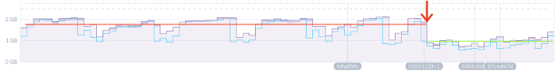
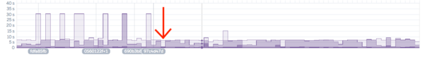

# Chúng tối đã giảm một nửa bộ nhớ tiêu thụ khi sử dụng Rails với jemalloc như thế nào?
Link bài viết gốc: [How we halved our memory consumption in Rails with jemalloc](https://medium.com/rubyinside/how-we-halved-our-memory-consumption-in-rails-with-jemalloc-86afa4e54aa3)

Một trong những dự án đầu tiên tôi được tham gia ở [Valiant](http://valiant.finance/) là điều tra để tìm cách tối ưu hóa cải thiện hiệu suất và bộ nhớ tiêu trên các ứng dụng web viết bằng Rails của chúng tôi. Mặc dù đã nghe nhiều về nhưng lời phàn nàn có từ lâu đời về các ứng dựng viết bằng Rails chậm, cồng kềnh và dễ bị memory bloat, tôi vẫn chưa tìm ra giải pháp thực tế dễ điều hướng cho vấn đề này.


Cho đến khi chúng tôi tìm thấy jemalloc.

Ở nội dung bài viết này, tôi sẽ trình bày tổng quan ngắn gọn jemalloc là gì, làm thế nào để kiểm tra hiệu suất và lượng bộ nhớ tiêu  thụ của ứng dụng Rails hiện tại của bạn, làm thế nào để cài đặt jemalloc trên môi trường local và production, và cuối cùng, sẽ cho bạn xem kết quả của chúng tôi sau khi chuyển sang sử dụng jemalloc.

## Jemalloc là gì?
Ruby một cách truyền thông sử dụng function `malloc` của C để cấp phát, giải phóng và cấp phát lại bộ nhớ khi lưu trữ object.Jemalloc là một triển khai của malloc(3) và được phát triển bởi Jason Evans (vì thế `je` xuất hiện ở tên bắt đầu với malloc), hiệu quả hơn trong việc cấp phát bộ nhớ so các trình cấp phát bộ nhớ khác do tập trung vào việc tránh phân mảnh và khả năng mở rộng đồng thời.

## Bước 1: Kiểm tra lượng bộ nhớ tiêu thụ của ứng dụng
Để xác định xem liệu việc chuyển sang sử dụng jemalloc có thực sự đem lại hiệu quả giảm lượng bộ nhớ tiêu thụ của ứng dụng hay ko, đầu tiên bạn cần thực hiện kiểm tra lượng bộ nhớ đang sử dụng là bao nhiêu và tốc độ phản hồi của trang web hiện tại đang như thé nào. Để kiểm tra dưới môi trường local, tôi sử dụng các Gem:
```ruby
gem "memory_profiler"
gem "derailed_benchmarks
```

Để xác định tổng lượng bộ nhớ tiêu thụ của mỗi gem trong Gemfile, chạy lệnh
```
bundle exec derailed bundle:mem
```
Để chỉ hiển thị mình file với lượng bộ nhớ sử dụng lớn hơn một giá trị nhất định, sử dụng `CUT_OFF=0.3` (hay bất kì giá trị nào bạn muốn sử dụng). Chú ý rằng bởi vì Ruby chỉ require file một lần, nếu một file cùng được require bởi nhiều thư viện, chi phí chỉ bằng chi phí của thư viện đầu tiên require file đó.

Ví dụ một đoạn kết quả:
```
TOP: 70.2617 MiB
  rails/all: 16.4805 MiB
    rails: 6.1523 MiB (Also required by: active_record/railtie, active_model/railtie, and 8 others)
      rails/application: 4.707 MiB
        rails/engine: 3.543 MiB (Also required by: coffee/rails/engine)
          rails/railtie: 3.293 MiB (Also required by: global_id/railtie, sprockets/railtie, and 3 others)
            rails/configuration: 3.1484 MiB (Also required by: rails/railtie/configuration)
              active_support/core_ext/object: 3.0469 MiB (Also required by: paper_trail/has_paper_trail)
                active_support/core_ext/object/conversions: 2.5078 MiB
                  active_support/core_ext/hash/conversions: 1.8945 MiB (Also required by: active_record/serializers/xml_serializer, active_model/serializers/xml)
                    active_support/time: 1.7031 MiB (Also required by: active_record/base)
                      active_support/core_ext/time: 1.625 MiB
                        active_support/core_ext/time/calculations: 1.5391 MiB (Also required by: active_support/core_ext/numeric/time, active_support/core_ext/string/conversions)
                          active_support/core_ext/time/conversions: 1.1094 MiB (Also required by: active_support/core_ext/time, active_support/core_ext/date_time/conversions)
                            active_support/values/time_zone: 1.0664 MiB (Also required by: active_support/time_with_zone, active_support/core_ext/date_time/conversions)
                              tzinfo: 0.8438 MiB (Also required by: et-orbi)
                                tzinfo/timezone: 0.3867 MiB
```

Ngoài ra, trên môi trường production, bạn có thể thấy nhiều bộ nhớ được cấp phát cho các đối tượng khi các dependencies được require đang bằng câu lệnh:
```bash
bundle exec derailed bundle:objects
```
Bên dưới là mẫu của một số object được tạo bởi các gem:
```
348351  activesupport
66931  erubis
54842  json
23655  addressable
15078  bundler
14833  heroics
13313  ruby
13034  haml
7186  actionpack
6370  sass
```
Để kiểm tra xem bạn có bị memory leak trên production hay ko, bạn có thể sử dụng:
```
bundle exec derailed exec perf:mem_over_time
```
>*Tip*: ban có thể chỉ định số lần bạn muốn test chạy thay vì dể chạy mãi mãi bằng cách sử dụng: `TEST_COUNT=20_000 bundle exec derailed exec perf:mem_over_time`

Câu lệnh trên gửi nhiều request đến ứng dụng và đo lượng bộ nhớ sử dụng theo thời gian. Nếu ứng dụng của bạn bị memory leak, lượng bộ nhớ sử dụng sẽ tăng liên tục, nếu ko bị, lượng bộ nhớ sử dụng sẽ tăng đến một ngưỡng nhất định, sau đó thì ko tăng nữa

Các kết quả thay đổi (và dường như thay đổi một chút khi chạy 2.000 test so với 20.000 test), bằng việc chạy test một số lần nhất định, chúng tôi phát hiện ra mức tiêu thụ trung bình của quay quanh mốc 1.7 MiB - 1.8 MiB, nó đại khái gần như tương ứng với Heroku log, với kết quả quanh mốc 1.6 MiB

## Bước 2: Kiểm tra hiệu suất và tốc độ của ứng dụng
Để kiểm tra hiệu quả tổng thể của ứng dụng, bạn có thể gọi đến một endpoint của ứng dụng với `benchmark-ips` với câu lệnh:
```
bundle exec derailed exec perf:ips
```
Giá trị càng lớn sẽ tốt hơn bởi vì nó thể hiện nhiều vòng lặp của code được chạy hơn trong 1 đơn vị thời gian. Một số kết quả của chúng tôi đo được:
```
Warming up --------------------------------------
                 ips     1.000  i/100ms
Calculating -------------------------------------
                 ips      5.070  (± 0.0%) i/s -     26.000  in   5.141956s

Warming up --------------------------------------
                 ips     1.000  i/100ms
Calculating -------------------------------------
                 ips      5.162  (± 0.0%) i/s -     26.000  in   5.051505s

Warming up --------------------------------------
                 ips     1.000  i/100ms
Calculating -------------------------------------
                 ips      4.741  (± 0.0%) i/s -     24.000  in   5.125214s
```

## Bước 3: cài đặt jemalloc
Để cài đặt jemalloc với local, chỉ cần thêm gem vào Gemfile:
```
gem 'jemalloc'
```
Chú ý: nếu sử dụng rvm (và nếu bạn đã cài ruby 2.4.1) chạy `rvm reinstall 2.4.1 -C —with-jemalloc` để cài đặt lại ruby vơi jemalloc.

Để kiểm tra version Ruby hiện tại có sử dụng jemalloc chạy:
```
ruby -r rbconfig -e "puts RbConfig::CONFIG['LIBS']"
```
Bạn sẽ nhận được kết quả như sau:
```
-lpthread -ljemalloc -ldl -lobjc
```
Đối với môi trường production, có vài cách để thêm jemalloc trên Heroku nhưng cách đơn giản nhất là thêm build pack với câu lệnh:
```
heroku buildpacks:add --index 1 https://github.com/mojodna/heroku-buildpack-jemalloc.git --app [your app name here]
```
Để xác nhận jemalloc đã được thêm vào, chạy `heroku buildpacks --app [your app name here]` và bạn sẽ thấy các bản build pack được liệt kê.

Một cách thay thế, bạn có thể thêm build pack ở `Setting → Buildpacks → Add buildpack` ở bảng điều khiển của Heroku.

## Bước 4: Kiểm tra kết quả dưới local
Chạy cùng câu lệnh ở bước 1 để kiểm tra lượng bộ nhớ tiêu  thụ, kết quả cho thấy bộ nhớ tiêu thụ 8.6953 MiB (9.117 MB), tiết kiệm 12.38% bộ nhớ trên toàn ứng dụng. Vơi việc cấp phát bộ nhớ cho object theo vị trí, chúng tôi tiết kiệm đượ c  5,064 MiB (5,310 MB) bộ nhớ

## Bước 5: Kiểm tra kết quả trên production
Chúng tôi kiểm tra tải http với và các công cụ benchmarking, để làm quá tải ứng dụng review của chúng tôi bằng các request. Khi không sử dụng jemalloc, chúng tôi thấy rằng trung bình 2.5 transaction/s, và trung bình khoảng 60 transaction thất bại trong vòng 20 phút. Với jemalloc, chúng tôi đặt tới 6.6 transaction/s và chỉ 1.5 transaction thất bại trong vòng 20 phút.

Ấn tượng nhất, kết quả trên bảng điều khiển Heroku cho kết quả đáng chú ý, gần như ngay lập tức được cải thiện. Trước jemalloc, lượng bộ nhớ sử dụng của khoảng 2GB trước khi được tự động khởi động lại. Sau khi sử dụng jemalloc, lượng bộ nhớ tiêu thụ giảm xuống 1GB và tránh việc khởi động lại ứng dụng


Tương tự, thời gian phản hồi của các request cũng được giảm xuống một cách nhanh chóng, trước jemalloc, vài request mất đến 30s, sau khi dùng jemalloc thời gian response giảm xuống còn 5-10s

