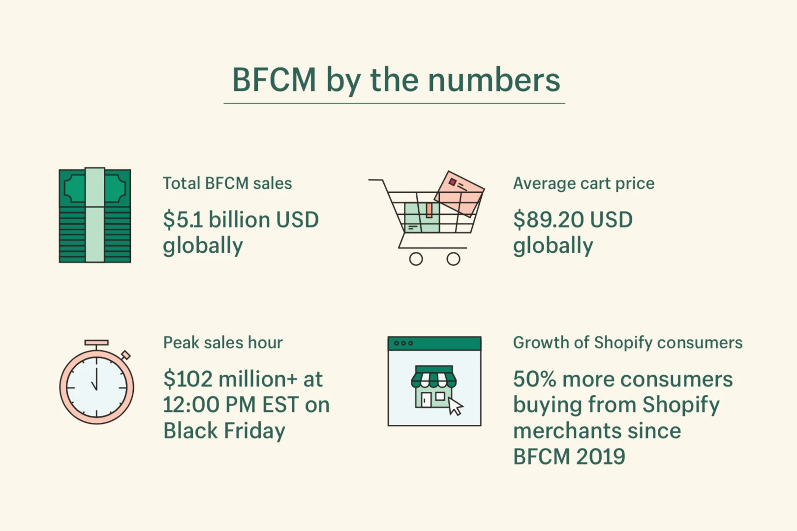

## High Availability by Offloading Work Into the Background
Lưu lượng truy cập tăng đột biến không lường trước được, yêu cầu chậm đến cổng thanh toán của bên thứ ba hoặc xử lý hình ảnh tốn thời gian có thể dễ dàng làm
choáng ngợp ứng dụng, khiến ứng dụng phản hồi chậm hoặc hoàn toàn không có phản hồi. Trong ngày  Black Friday Cyber Monday (BFCM) 2021, các thương gia trên
 Shopify đã đạt doanh thu hơn 5 tỷ USD, với doanh số cao nhất là hơn 100 triệu USD mỗi giờ. Trên quy mô lớn như vậy, tính khả dụng cao và thời gian phản hồi ngắn
 là rất quan trọng. Nhưng ngay cả đối với các ứng dụng nhỏ hơn, tính khả dụng và thời gian phản hồi rất quan trọng để có trải nghiệm người dùng tuyệt vời.

## High Availability

Tính sẵn sàng cao thường đi kèm với thời gian hoạt động của máy chủ cao. Nhưng nó không đủ kể cả khi máy chủ không gặp sự cố hoặc tắt. Trong trường hợp của Shopify, người bán của chúng tôi cần có khả năng bán hàng. Vì vậy, người mua cần có khả năng tương tác với ứng dụng. Một banner nói “quay lại sau” là không đủ và chỉ phục vụ một người mua tại một thời điểm cũng không đủ tốt. Để xem xét một ứng dụng có sẵn, cộng đồng người dùng cần có những tương tác với ứng dụng đó. Tính khả dụng có thể được coi là cao nếu những tương tác này có thể thực hiện được bất cứ khi nào người dùng cần.

## Offloading Work

Để khả dụng, ứng dụng cần có khả năng chấp nhận các yêu cầu gửi đến. Nếu phần bên ngoài của ứng dụng (máy chủ ứng dụng) cũng đang thực hiện job nặng cần thiết để xử lý các yêu cầu, nó có thể nhanh chóng trở nên quá tải và không khả dụng cho các yêu cầu mới đến. Để tránh điều này, chúng tôi có thể giảm tải một số job nặng vào một phần khác của hệ thống, di chuyển nó ra ngoài chu kỳ phản hồi yêu cầu chính để không ảnh hưởng đến khả năng chấp nhận và phục vụ các yêu cầu đến của máy chủ ứng dụng. Điều này cũng rút ngắn thời gian phản hồi, mang lại trải nghiệm người dùng tốt hơn.

Các tác vụ thường được giảm tải bao gồm:
+ Gửi e-mail
+ Xử lý hình ảnh và video
+ Kích hoạt webhook hoặc thực hiện yêu cầu của bên thứ ba
+ Xây dựng lại các chỉ mục tìm kiếm
+ Nhập các tập dữ liệu lớn
+ Dọn dẹp dữ liệu cũ

Lợi ích của việc giảm tải một tác vụ đặc biệt lớn nếu tác vụ đó chậm, tiêu tốn nhiều tài nguyên hoặc dễ xảy ra lỗi.

Ví dụ: khi người dùng mới đăng ký một ứng dụng web, ứng dụng đó thường tạo một tài khoản mới và gửi cho họ một email chào mừng. Việc gửi email là ko cần thiết để
tài khoản của người dùng có thể sử dụng và user cũng ko cần nhận được mail ngay lập tức. Sẽ chẳng có lợi ích gì khi gửi mail trong request-response cycle.
Người dùng sẽ không phải đợi email được gửi đi, họ sẽ có thể bắt đầu sử dụng ứng dụng ngay lập tức và máy chủ ứng dụng sẽ không phải gánh vác nhiệm vụ gửi email.

Bất kỳ nhiệm vụ nào không bắt buộc phải hoàn thành trước khi gửi phản hồi cho người gọi là một ứng cử viên để giảm tải. Khi tải hình ảnh lên ứng dụng web, tệp hình ảnh cần được xử lý và ứng dụng có thể muốn tạo hình thu nhỏ ở các kích thước khác nhau. Người dùng thường không yêu cầu xử lý hình ảnh thành công, vì vậy thường có thể giảm tải tác vụ này. Tuy nhiên, máy chủ sẽ ko thể phản hồi ngày lập tức thông báo “hình ảnh đã được xử lý thành công” hoặc “đã xảy ra lỗi xử lý hình ảnh”. Bây giờ, tất cả những gì nó có thể phản hồi là “hình ảnh đã được tải lên thành công, nó sẽ xuất hiện trên trang web sau này nếu mọi thứ diễn ra như kế hoạch.” Do tính chất rất tốn thời gian của việc xử lý hình ảnh, sự đánh đổi này thường rất xứng đáng, với sự cải thiện lớn về thời gian phản hồi và những lợi ích về tính khả dụng mà nó mang lại.

## Background Jobs
Background jobs là một cách tiếp cận để giảm tải job. Background jobs là một job sẽ được thực hiện sau đó, bên ngoài chu trình phản hồi yêu cầu. Máy chủ ứng dụng ủy quyền nhiệm vụ, ví dụ, xử lý hình ảnh, cho một quy trình worker, thậm chí có thể đang chạy trên một máy hoàn toàn khác. Máy chủ ứng dụng cần giao tiếp tác vụ với worker. Worker có thể bận và không thể thực hiện nhiệm vụ ngay lập tức, nhưng máy chủ ứng dụng không cần phải đợi phản hồi từ worker. Việc đặt một hàng đợi thông báo giữa máy chủ ứng dụng và worker sẽ giải quyết được tình trạng khó xử này, làm cho giao tiếp của họ không đồng bộ. Người gửi và người nhận tin nhắn có thể tương tác với hàng đợi một cách độc lập tại các thời điểm khác nhau. Máy chủ ứng dụng đặt một thông báo vào hàng đợi và tiếp tục, ngay lập tức trở nên sẵn sàng để chấp nhận nhiều yêu cầu đến hơn. Thông báo là nhiệm vụ được thực hiện bởi worker, đó là lý do tại sao hàng đợi thông báo như vậy thường được gọi là hàng đợi tác vụ. worker có thể xử lý các thông báo từ hàng đợi với tốc độ riêng của nó. Phần phụ trợ background jobs về cơ bản là một số hàng đợi nhiệm vụ cùng với một số mã để quản lý worker.

## Features
Shopify queues hàng chục nghìn job mỗi giây để tận dụng nhiều tính năng khác nhau.

## Response times
Sử dụng background job cho phép chúng tôi tách yêu cầu bên ngoài (do máy chủ ứng dụng cung cấp) khỏi bất kỳ tác vụ phụ trợ tốn thời gian nào (được thực thi bởi worker).
Do đó cải thiện thời gian phản hồi. Điều gì cải thiện thời gian phản hồi cho các yêu cầu riêng lẻ cũng cải thiện tính khả dụng tổng thể của hệ thống.

## Spikeability
Chẳng hạn, việc tải lên hình ảnh tăng đột biến sẽ không ảnh hưởng gì nếu việc xử lý hình ảnh tốn thời gian được thực hiện bởi một background job. Tính khả dụng và thời gian phản hồi của máy chủ ứng dụng bị hạn chế bởi tốc độ mà nó có thể xếp hàng các job xử lý hình ảnh. Nhưng tốc độ xếp hàng đợi nhiều job hơn không bị hạn chế bởi tốc độ xử lý chúng. Nếu worker không thể theo kịp với số lượng tác vụ xử lý hình ảnh tăng lên, hàng đợi sẽ tăng lên. Nhưng hàng đợi đóng vai trò như một bộ đệm giữa máy chủ và máy chủ ứng dụng để người dùng có thể tiếp tục tải hình ảnh lên như bình thường. Với việc Shopify đối mặt với lưu lượng truy cập tăng đột biến lên đến 170 nghìn yêu cầu mỗi giây, các background job là điều cần thiết để duy trì tính khả dụng cao mặc dù lưu lượng truy cập không thể đoán trước.

## Retries and Redundancy
Khi một worker gặp lỗi trong khi thực hiện job, job sẽ được sắp xếp lại và thử lại sau đó. Vì tất cả những điều đó đang diễn ra ở phía sau, nó không ảnh hưởng đến tính khả dụng hoặc thời gian phản hồi của máy chủ ứng dụng bên ngoài. Nó làm cho các job nền trở nên phù hợp tuyệt vời cho các tác vụ dễ xảy ra lỗi như yêu cầu đối với bên thứ ba không đáng tin cậy.

## Parallelization

Một số worker có thể xử lý các thông báo từ cùng một hàng đợi cho phép nhiều tác vụ được thực hiện đồng thời. Đây là phân phối khối lượng job.
Chúng ta cũng có thể chia một nhiệm vụ lớn thành một số nhiệm vụ nhỏ hơn và xếp chúng vào hàng đợi như các job nền riêng lẻ để một số nhiệm vụ con này được thực hiện đồng thời.

## Prioritization

Hầu hết background job cho phép sắp xếp các job ưu tiên. Họ có thể sử dụng các hàng đợi ưu tiên không tuân theo phương pháp FIFO để các job có mức độ ưu tiên cao kết thúc bằng việc cắt ngang hàng. Hoặc họ thiết lập các hàng đợi riêng biệt cho các job có mức độ ưu tiên khác nhau và định cấu hình worker để ưu tiên các job từ các hàng đợi có mức độ ưu tiên cao hơn. Không có worker nào cần phải hoàn toàn chuyên tâm vào các job có mức độ ưu tiên cao, vì vậy bất cứ khi nào không có job ưu tiên cao nào trong hàng đợi, worker sẽ xử lý các job có mức độ ưu tiên thấp hơn. Điều này mang tính hữu ích, giảm đáng kể thời gian nhàn rỗi của worker.

## Event-based and Time-based Scheduling

Các background job không phải lúc nào cũng được máy chủ ứng dụng xếp hàng đợi. Một worker đang xử lý một job cũng có thể xếp hàng một job khác. Trong khi họ xếp hàng các job dựa trên các sự kiện như tương tác của người dùng hoặc một số dữ liệu bị thay đổi, một bộ lập lịch có thể xếp hàng các job dựa trên thời gian (ví dụ: để sao lưu hàng ngày).

## Simplicity of Code
Phần background job đóng gói giao tiếp không đồng bộ giữa ứng dụng giữa client request và worker thực thi job. Việc đặt sự phức tạp này vào một lớp trừu tượng riêng biệt sẽ giữ cho các lớp job cụ thể trở nên đơn giản. Một lớp job cụ thể chỉ triển khai nhiệm vụ cần thực hiện (ví dụ: gửi email chào mừng hoặc xử lý hình ảnh). Nó không biết về việc đang được chạy trong tương lai, đang được chạy trên một trong số một số worker hoặc được thử lại sau khi có lỗi.

## Challenges
Giao tiếp không đồng bộ đặt ra một số thách thức không biến mất bằng cách gói gọn một số sự phức tạp của nó. Background job không có gì khác biệt.

## Breaking Changes to Job Parameters
Client đang queuing job và worker xử lý job đó không phải lúc nào cũng chạy cùng một phiên bản phần mềm. Một trong số chúng có thể đã được triển khai với phiên bản mới hơn. Tình trạng này có thể kéo dài trong một khoảng thời gian đáng kể, đặc biệt nếu thực hành sử dụng  canary deployments. Các thay đổi đối với các tham số job có thể phá vỡ ứng dụng nếu một job đã được xếp hàng với một tập hợp tham số nhất định, nhưng worker xử lý job mong đợi một tập hợp khác. Các thay đổi phá vỡ đối với các tham số job cần phải thực hiện thông qua một chuỗi các thay đổi để duy trì khả năng tương thích ngược cho đến khi tất cả các job kế thừa từ hàng đợi đã được xử lý.

## No Exactly-once Delivery
Khi một worker hoàn thành job, nó sẽ báo lại rằng hiện đã an toàn để xóa job khỏi hàng đợi. Nhưng điều gì sẽ xảy ra nếu worker đang xử lý job vẫn im lặng? Chúng tôi có thể cho phép những worker khác nhận một job như vậy và điều hành nó. Điều này đảm bảo rằng job sẽ chạy ngay cả khi worker đầu tiên bị crash. Nhưng nếu worker đầu tiên chỉ đơn giản là chậm hơn một chút so với dự kiến, job của chúng tôi sẽ chạy gấp đôi. Mặt khác, nếu chúng ta không cho phép những worker khác nhận job, thì job đó sẽ hoàn toàn không chạy nếu worker đầu tiên gặp sự cố. Vì vậy, chúng tôi phải quyết định điều gì tồi tệ hơn: hoàn toàn không chạy job hay chạy nó hai lần. Nói cách khác, chúng ta phải lựa chọn giữa delivery ít nhất và nhiều nhất một lần.

Ví dụ: không tính phí client không phải là lý tưởng, nhưng tính phí họ hai lần có thể tồi tệ hơn đối với một số doanh nghiệp. delivery nhiều nhất một lần nghe đúng trong trường hợp này. Tuy nhiên, nếu mọi khoản phí đều được theo dõi cẩn thận và job kiểm tra các trạng thái đó trước khi tính phí thì việc chạy job lần thứ hai sẽ không dẫn đến khoản phí thứ hai. job này rất quan trọng, cho phép chúng tôi lựa chọn delivery ít nhất một lần một cách an toàn.

## Non-Transactional Queuing
Hàng đợi job thường nằm trong một kho dữ liệu riêng biệt. Redis là một lựa chọn phổ biến cho hàng đợi, trong khi nhiều ứng dụng web lưu trữ dữ liệu hoạt động của chúng trong MySQL hoặc PostgreSQL. Khi transaction ghi dữ liệu hoạt động được mở, việc xếp hàng đợi job sẽ không phải là một phần của transaction kèm theo này - ghi job vào Redis không phải là một phần của transaction MySQL hoặc PostgreSQL. Job được xếp hàng đợi ngay lập tức và có thể kết thúc được xử lý trước khi transaction được commit (hoặc ngay cả khi nó quay trở lại).

Khi chấp nhận đầu vào bên ngoài từ sự tương tác của người dùng, thông thường người ta ghi một số dữ liệu hoạt động với quá trình xử lý rất tối thiểu và enqueue một job thực hiện các bước bổ sung để xử lý dữ liệu đó. Job này có thể không tìm thấy dữ liệu mà nó cần trừ khi chúng tôi xếp hàng đợi nó sau khi thực hiện transaction ghi dữ liệu hoạt động. Tuy nhiên, hệ thống có thể gặp sự cố sau khi thực hiện transaction và trước khi enqueue job. Job sẽ không bao giờ chạy, các bước bổ sung để xử lý dữ liệu sẽ không được thực hiện, khiến hệ thống ở trạng thái không nhất quán.

Mẫu outbox pattern có thể được sử dụng để tạo hàng đợi job theo giai đoạn giao dịch. Thay vì xếp hàng đợi job ngay lập tức, các tham số job được ghi vào một bảng phân giai đoạn trong kho dữ liệu. Đây có thể là một phần của database transaction ghi dữ liệu. Bộ lập lịch có thể kiểm tra định kỳ bảng, xếp hàng các job và cập nhật bảng khi job được enqueue thành công. Vì bản cập nhật này cho bảng dàn dựng có thể không thành công ngay cả khi job đã được xếp hàng đợi, job được xếp hàng đợi ít nhất một lần và phải là không quan trọng.

Tùy thuộc vào khối lượng job, hàng đợi job theo giai đoạn giao dịch có thể dẫn đến tải khá nhiều trên cơ sở dữ liệu. Và mặc dù cách tiếp cận này đảm bảo enqueue job, nhưng nó không thể đảm bảo rằng chúng sẽ chạy thành công.

## Local Transactions
Một quy trình nghiệp vụ có thể liên quan đến việc ghi cơ sở dữ liệu từ máy chủ ứng dụng phục vụ request và worker đang chạy một số job. Điều này tạo ra vấn đề về local database transactions. Cuối cùng đạt được sự nhất quán khi local database transaction được commit. Nhưng nếu một trong các job không thực hiện được dữ liệu của nó, hệ thống lại ở trạng thái không nhất quán. Pattern SAGA có thể được sử dụng để đảm bảo tính nhất quán cuối cùng. Ngoài các job xếp hàng theo transaction, các job cũng báo cáo lại staging table khi chúng thành công. Người lập lịch có thể kiểm tra bảng này và phát hiện những điểm không nhất quán. Điều này dẫn đến tải cơ sở dữ liệu thậm chí còn cao hơn so với một hàng đợi job theo giai đoạn giao dịch.

## Out of Order Delivery
Các job rời khỏi hàng đợi theo thứ tự được xác định trước, nhưng chúng có thể kết thúc với những worker khác nhau và không thể đoán trước được job nào hoàn thành nhanh hơn. Và nếu một job không thành công và được xếp lại, nó sẽ được xử lý sau đó. Vì vậy, nếu chúng tôi đang enqueue một số job ngay lập tức, chúng có thể hết thứ tự. Pattern SAGA có thể đảm bảo các job được chạy theo đúng thứ tự nếu staging table cũng được sử dụng để duy trì thứ tự job.

Một giải pháp thay thế nhẹ hơn có thể được sử dụng nếu không quan tâm đến sự đảm bảo về tính nhất quán. Khi một job đã hoàn thành nhiệm vụ của nó, nó có thể xếp hàng đợi một job khác như một phần tiếp theo. Điều này đảm bảo các job chạy theo thứ tự được xác định trước. Phương pháp này nhanh chóng và dễ thực hiện vì nó không yêu cầu bảng dàn hoặc bộ lập lịch và không tạo thêm bất kỳ tải nào trên cơ sở dữ liệu. Nhưng hệ thống kết quả có thể trở nên khó gỡ lỗi và bảo trì vì nó đang đẩy tất cả sự phức tạp của nó xuống một chuỗi job dài tiềm ẩn xếp hàng các job khác và rất ít khả năng quan sát xem chính xác mọi thứ có thể đã sai ở đâu.

## Long Running Jobs
Một job không nhất thiết phải nhanh như yêu cầu của người dùng, nhưng các job kéo dài có thể gây ra vấn đề. Ví dụ: background job ruby phổ biến Resque ngăn worker ngừng hoạt động trong khi job đang chạy. Worker này không thể được triển khai. Nó cũng không thân thiện với cloud, vì tài nguyên bắt buộc phải có sẵn trong một khoảng thời gian đáng kể liên tiếp. Một background job backend khác của ruby, Sidekiq, hủy và xếp hàng lại job khi server của worker bị tắt. Tuy nhiên, trong lần tiếp theo job đang chạy, nó sẽ bắt đầu lại từ đầu, vì vậy nó có thể bị hủy bỏ một lần nữa trước khi hoàn thành. Nếu việc triển khai diễn ra nhanh hơn mức job có thể hoàn thành, job sẽ không có cơ hội thành công. Với cốt lõi của việc Shopify triển khai khoảng 40 lần một ngày, đây không phải là một cuộc thảo luận học thuật mà là một vấn đề thực tế mà chúng tôi cần giải quyết.

May mắn thay, nhiều job chạy dài có bản chất tương tự: chúng lặp lại trên một tập dữ liệu khổng lồ. Shopify đã phát triển và mở nguồn mở rộng cho khung job Active Job của Ruby on Rails, giúp loại job này có thể bị gián đoạn và có thể tiếp tục lại. Nó thiết lập một điểm kiểm tra sau mỗi lần lặp lại và sắp xếp lại job. Lần tới khi job được xử lý, job vẫn tiếp tục tại điểm kiểm tra, cho phép job bị gián đoạn một cách an toàn và dễ dàng. Với các job có thể bị gián đoạn và có thể tiếp tục, worker có thể ngừng hoạt động bất kỳ lúc nào, điều này làm cho họ thân thiện hơn với đám mây và cho phép triển khai thường xuyên. Ví dụ: có thể điều chỉnh hoặc tạm dừng job để phòng chống thiên tai nếu có nhiều tải trên cơ sở dữ liệu. Việc làm gián đoạn job cũng cho phép di chuyển dữ liệu giữa các phân đoạn cơ sở dữ liệu một cách an toàn.

## Distributed Background Jobs

Các background job backend như Resque và Sidekiq trong Ruby thường xếp hàng một job bằng cách đặt một đối tượng được tuần tự hóa vào hàng đợi, một thể hiện của lớp job cụ thể. Điều này ngụ ý rằng cả client đang xếp hàng đợi job và worker xử lý nó cần để có thể làm việc với đối tượng này và có một triển khai của lớp này. Điều này hoạt động tuyệt vời trong một kiến ​​trúc monolithic , nơi client và worker đang chạy cùng một cơ sở mã. Nhưng nếu chúng ta muốn, ví dụ, trích xuất quá trình xử lý hình ảnh thành một microservice xử lý hình ảnh chuyên dụng, thậm chí có thể được viết bằng một ngôn ngữ khác, chúng ta cần một cách tiếp cận khác để giao tiếp.

Có thể sử dụng Sidekiq với các dịch vụ riêng biệt, nhưng các worker vẫn cần được viết bằng Ruby và client phải chọn hàng đợi redis phù hợp cho một job. Vì vậy, cách tiếp cận này không dễ dàng áp dụng cho kiến ​​trúc microservices quy mô lớn, nhưng tránh được chi phí phải thêm một message broker như RabbitMQ.

Middleware như RabbitMQ đặt một giao diện hoàn toàn dựa trên dữ liệu giữa producer và consumer , chẳng hạn như JSON payload. Message broker có thể đóng vai trò là một background job backend phân tán, nơi client có thể giảm tải job cho các worker đang chạy một cơ sở mã hoàn toàn khác.

Thay vì các hàng đợi point-to-point đơn giản, các topic dụng hàng đợi tác vụ bổ sung thêm tính năng định tuyến mạnh mẽ. Ngược lại với HTTP, định tuyến này không giới hạn ở 1: 1. Ngoài việc ủy ​​quyền các nhiệm vụ cụ thể, ,messaging  có thể được sử dụng cho các thông báo sự kiện khác nhau bất cứ khi nào cần giao tiếp giữa các microservices. Với các tin nhắn bị xóa sau khi xử lý, không có cách nào để phát lại luồng tin nhắn và không có nguồn xác thực cho trạng thái trên toàn hệ thống.

Event streaming như Kafka có một cách tiếp cận hoàn toàn khác: các sự kiện được ghi vào nhật ký sự kiện chỉ thêm vào. Tất cả consumer chia sẻ cùng một nhật ký và có thể đọc nó bất cứ lúc nào. Bản thân broker là stateless; nó không theo dõi mức tiêu thụ sự kiện. Các sự kiện được nhóm thành các chủ đề, cung cấp một số khả năng đăng ký xuất bản có thể được sử dụng để giảm tải job cho các dịch vụ khác nhau. Những chủ đề này không dựa trên hàng đợi và các sự kiện sẽ không bị xóa. Vì nhật ký sự kiện có thể được phát lại. Với một nhà stateless broker và chỉ ghi phần nối vào, thông lượng cực kỳ cao — rất phù hợp cho các ứng dụng thời gian thực và truyền dữ liệu.

Background job cho phép máy chủ ứng dụng giao diện người dùng ủy quyền nhiệm vụ cho worker. Với ít job hơn trên đĩa của nó, máy chủ ứng dụng có thể phục vụ các yêu cầu từ phía người dùng nhanh hơn và duy trì tính khả dụng cao hơn, ngay cả khi đối mặt với lưu lượng truy cập tăng đột biến không thể đoán trước hoặc xử lý các tác vụ phụ trợ tốn thời gian và dễ xảy ra lỗi. Phần background job đóng gói sự phức tạp của giao tiếp không đồng bộ giữa client và worker thành một lớp trừu tượng riêng biệt, để mã cụ thể vẫn đơn giản và có thể bảo trì được.

Tính khả dụng cao và thời gian phản hồi ngắn là cần thiết để cung cấp trải nghiệm người dùng tuyệt vời, làm cho các background job trở thành công cụ không thể thiếu bất kể quy mô của ứng dụng.
