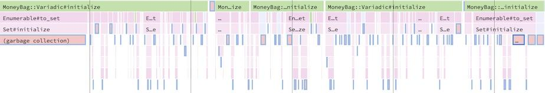
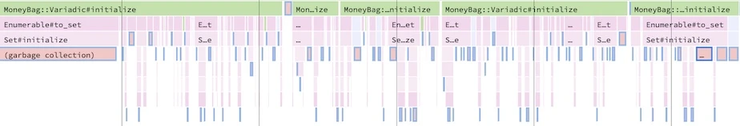

## How to Fix Slow Code in Ruby

Ở Shopify, chúng tôi tin tưởng vào các team  được liên kết chặt chẽ với nhau để giúp phát triển nhanh chóng. Vì có nhiều nhóm làm việc độc lập trên một ứng dụng Rails nguyên khối lớn ([Monolithic Application](https://en.wikipedia.org/wiki/Monolithic_system)), các đoạn code ko được tối ưu vô tình được thêm vào codebase. Theo thời gian dẫn đến sự tụt giảm nghiêm trọng về hiệu suất.

Đến thời điểm sự tụt giảm về hiệu suất trở nên đáng chú ý thì đã quá muộn để theo dõi và tìm ra các commit vi phạm. Đấy là điều cực kì thách thức với [code base với hàng nghìn commit thay đổi mỗi ngày](https://engineering.shopify.com/blogs/engineering/successfully-merging-work-1000-developers?shpxid=a7774517-A0A6-4B47-464B-4E1B8FF0FDA5).
Làm cách nào để chúng tôi ra nguyên nhân quả tại sao ứng dụng của chúng tôi chậm một cách hiệu quả? Ngay cả khi chúng tôi có bản sửa lỗi cho code chậm, làm thế nào chúng tôi có thể chứng minh rằng code mới của chúng tôi nhanh hơn?

Tất cả bắt đầu với việc profiling và benchmarking. Năm ngoái, chúng tôi đã viết về cách [viết code nhanh trong Ruby on Rails](https://engineering.shopify.com/blogs/engineering/write-fast-code-ruby-rails?shpxid=a7774517-A0A6-4B47-464B-4E1B8FF0FDA5). Biết cách viết code nhanh là hữu ích, nhưng không đủ nếu không biết cách sửa code chậm. Hãy nói về các phương pháp mà chúng tôi có thể sử dụng để tìm code chậm, sửa lỗi và chứng minh rằng giải pháp mới của chúng tôi nhanh hơn. Chúng ta cũng sẽ khám phá một số case study có các ví dụ thực tế về việc sử dụng profiling và benchmarking.

## Profiling
Trước khi đi sâu vào việc sửa code không hiệu quả, chúng ta cần tìm nó trước. Việc xác định code gây ra tắc nghẽn hiệu suất có thể là một thách thức trong một code base lớn. Profiling giúp chúng tôi tìm ra cách dễ dàng.

### Profiling là gì?
Profiling là một loại chương trình phân tích thu thập các số liệu về chương trình trong thời gian chạy, chẳng hạn như tần suất và thời lượng của các lệnh gọi phương thức. Nó được thực hiện bằng cách sử dụng một công cụ được gọi là profiler, và đầu ra của profilercó thể được hiển thị theo nhiều cách khác nhau.  Ví dụ: flat profiles, call graphs, và flamegraphs.

### Tại sao tôi nên profile code code của mình?
Một số vấn đề khó phát hiện bằng cách chỉ nhìn vào code (phân tích tĩnh, đánh giá code). Một trong những mục tiêu chính của profiling là khả năng quan sát. Bằng cách biết những gì đang diễn ra trong thời gian chạy, chúng tôi hiểu rõ hơn về những gì chương trình đang làm và lý do tại sao ứng dụng chạy chậm.Profiling giúp chúng tôi thu hẹp phạm vi để tìm điểm gây ra vấn đề về hiệu suất xuống một khu vực cụ thể.

### Tôi đã profile như thế nào?
Trước khi chúng tôi tìm ra những gì cần để profile, trước tiên chúng ta cần tìm hiểu những gì chúng ta muốn biết: chúng ta có muốn đo thời gian chạy cho một đoạn code cụ thể không, hay chúng ta muốn đo lường cấp phát cho các đốit tượng trong đoạn code đó? Về mức độ chi tiết, chúng ta có cần thời gian chạy cho mỗi lần gọi phương thức trong đoạn code đó không hay chúng ta chỉ cần giá trị tổng hợp? Thời gian chạy qua ở đây có thể được chia nhỏ thành [thời gian CPU](https://en.wikipedia.org/wiki/CPU_time) hoặc  [wall time](https://en.wikipedia.org/wiki/Elapsed_real_time).

Để đo thời gian đã chạy, phương pháp đơn giản là đo thời gian bắt đầu và thời gian kết thúc của một đoạn code cụ thể và tính thơi gian chênh lệch. Nếu chúng ta cần độ chi tiết cao hơn, chúng ta làm điều này cho mọi method. Để làm điều này, chúng tôi sử dụng [TracePoint](https://ruby-doc.org/core-2.6.5/TracePoint.html) API của Ruby để hook mỗi lần gọi method trong Ruby. Tương tự, đối với phân bổ cấp phát cho object, chúng tôi sử dụng [ObjectSpace](https://ruby-doc.org/stdlib-2.6.5/libdoc/objspace/rdoc/ObjectSpace.html) module để theo dõi phân bổ object. hoặc thậm chí kết xuất Ruby heap để quan sát nội dung của nó.

Tuy nhiên, thay vì xây dựng các giải pháp profiling, chúng ta có thể sử dụng một trong các trình profiling có sẵn và mỗi giải pháp đều có những ưu nhược điểm riêng. Dưới đây là một số tùy chọn:

#### 1. [rbspy](https://github.com/rbspy/rbspy)
rbspy lấy stack frames từ tiến trình Ruby theo thời gian. Ưu điểm chính là nó có thể được sử dụng như một chương trình độc lập mà không cần bất kỳ code để tinh chỉnh nào.

Khi chúng ta biết Mã định danh tiến trình Ruby (PID) mà chúng ta muốn profile, chúng ta bắt đầu phiên profile như sau:

```bash
rbspy record —pid $PID
```
#### 2. [stackprof](https://github.com/tmm1/stackprof)
Tương tự rbspy, stackprof lấy stack frames theo thời gian nhưng từ một đoạn code Ruby.Stackprof được sử dụng như một phương pháp profile cho các đoạn code tùy chỉnh:

```ruby
profile = StackProf.run(mode: :cpu) do
  # Code to profile
end
```
#### 3. [rack-mini-profiler](https://github.com/MiniProfiler/rack-mini-profiler)
`rack-mini-profiler` gem là một giải pháp profile đầy đủ tính năng cho các ứng dụng dựa trên Rack. Không giống như các trình profile được mô tả trong phần này, nó còn bao gồm memory profiler. Memory profiler thu thập dữ liệu như thống kê Garbage Collection (GC), số lượng cấp phát. Về bản chất nó sử dụng stackprof và memory_profiler gems.

#### 4. [app_profiler](https://github.com/Shopify/app_profiler)
`app_profiler` là một giải pháp thay thế  nhàng cho `rack-mini-profiler`. Nó chỉ chứa các Rack middleware hỗ trợ call-stack profilingcho các web request. Thêm vào đó, mức profiling là khả dụng cho bất kì ứng dụng Ruby nào. Những profiles này có thể được lưu trữ trong các bộ nhớ có thể cấu hình như Google Cloud Storage, và có thể được hiển thị thông qua một trình xem có thể định cấu hình như [Speedscope](https://github.com/jlfwong/speedscope), một trình duyệt dựa trên flamegraph viewer.

ở Shopify, chúng tôi thu thập performance profiles trong môi trường production của mình.  Rack Mini Profiler là một gem tuyệt vời, nhưng nó đi kèm với nhiều tính năng bổ sung như database và memory profiling, và nó có vẻ quá nặng đối với trường hợp sử dụng của chúng tôi. Do đó, chúng tôi đã xây dựng App Profiler sử dụng Stackprof tương tự. Hiện tại, gem này được sử dụng để hỗ trợ cơ sở hạ tầngprofiling từ xa theo yêu cầu của chúng tôi cho request trên môi trường production

### Case Study: Dùng App Profiler trên Shopify
Một ví dụ về vấn đề hiệu suất đã được xác định trên production có liên quan đến các chu trình GC không cần thiết. Năm ngoái, chúng tôi nhận thấy rằng một mặt hàng trong giỏ hàng với số lượng rất lớn đã sử dụng một lượng thời gian CPU vô lý và dẫn đến yêu cầu chậm. Hóa ra, vấn đề liên quan đến việc Ruby cấp phát quá nhiều đối tượng, kích hoạt GC nhiều lần

Hình bên dưới minh họa một phần của flamegraph cho một request chậm tương tự và phần này tương ứng với khoảng 500ms thời gian CPU.


Các phần được đánh dấu tương ứng với hoạt động GC, và chúng xen kẽ với các hoạt động thông thường. Từ phần này, chúng ta thấy rằng bản thân GC đã tiêu thụ khoảng 35% thời gian CPU, đó là rất nhiều! Chúng tôi suy luận rằng chúng tôi đã cấp phát quá nhiều đối tượng Ruby. Nếu không có profiling, rất khó để xác định các loại vấn đề này một cách nhanh chóng.

### Benchmarking
Bây giờ chúng ta đã biết làm cách xác định các vấn đề về hiệu suất, chúng ta làm cách nào để sửa? Benchmarking giúp chúng tôi chứng minh sự khác biệt về hiệu suất trong hai hoặc nhiều đường dẫn code khác nhau.

#### Benchmarking là gì?
Benchmarking là một cách đo lường hiệu suất của code. Thông thường, nó được sử dụng để so sánh hai hoặc nhiều đường dẫn code tương tự để xem đường dẫn code nào là nhanh nhất. Dưới đây là  đoạn benchmark ruby ​​đơn giản:

```ruby
# frozen_string_literal: true

require "benchmark"

def some_method
  sleep(1) # pause execution for 1 second
end

seconds = Benchmark.realtime { some_method }

puts "The method took #{seconds.truncate(2)} seconds."
```

Đoạn mã này là benchmark đơn giản nhất. Chúng tôi đang đo lường thời gian một method chạy trong vài giây, một phương trình toán học phức tạp, hoặc bất kỳ thứ gì khác nằm trong block. Công cụ đo này rất hữu ích vì nó có thể tiết lộ hồi quy hoặc cải thiện tốc độ theo thời gian.

Mặc dù wall time là một phép đo khá đáng tin cậy về “hiệu suất”, có những phương pháp khác mà người ta có thể đo lường code ngoài thời gian thực, Benchmark module chuẩn của thư viện tiêu chuẩn Ruby bao gồm bm và bmbm.

Phương pháp [bm](https://ruby-doc.org/stdlib-2.7.1/libdoc/benchmark/rdoc/Benchmark.html#method-c-bm) phân tích chi tiết hơn về các phép đo thời gian. Hãy xem một đoạn script với kết qủa đầu ra:
```ruby
# frozen_string_literal: true

require "benchmark"

def some_method
  sleep(1)
end

Benchmark.bm do |x|
  x.report("method") { some_method }
end
```


```
          user     system      total        real
method  0.000040   0.000030   0.000070 (  1.002846)
```
User, system, và total là tất cả các phép đo khác nhau về thời gian của CPU. User đề cập đến thời gian làm việc trong [ user space](https://en.wikipedia.org/wiki/User_space). Tương tự, system biểu thị thời gian làm việc trong kernel space. Total là tổng thời gian CPU và thực là số đo  wall time  mà chúng tôi đã thấy Benchmark. realtime.
Còn [bmbm](https://ruby-doc.org/stdlib-2.7.1/libdoc/benchmark/rdoc/Benchmark.html#method-c-bmbm) thì sao? Nó giống hệt bm với một điểm khác biệt duy nhất. Đây là kết quả đầu ra:

```
Rehearsal ------------------------------------------
method   0.000047   0.000035   0.000082 (  1.005247)
--------------------------------- total: 0.000082sec

             user     system      total        real
method   0.000033   0.000037   0.000070 (  1.003529)
```
Rehearsal hoặc bước khởi động là những gì làm cho bmbm hữu ích.  Nó chạy benchmark code blocks một lần trước khi đo để xác định bất kỳ bộ nhớ đệm hoặc cơ chế tương tự nào để tạo ra ổn định hơn.

Cuối cùng, hãy nói về  [benchmark-ips](https://github.com/evanphx/benchmark-ips). Đây là phương pháp phổ biến nhất để benchmark Ruby code. Bạn sẽ thấy nó rất nhiều trong tự nhiên, một đoạn script đơn giản trông như thế này:
```ruby
# frozen_string_literal: true

require "bundler/inline"

gemfile(true) do
  source "https://rubygems.org"
  gem "benchmark-ips"
end

require "benchmark/ips"

def some_method
  sleep(1)
end

Benchmark.ips do |x|
  x.report("method") { some_method }
end
```

Ở đây, chúng tôi đang benchmarking theo cùng một phương pháp sử dụng cú pháp quen thuộc với method ips. Chú ý đến đoạn code `bundler/inline` và gemfile code. Chúng ta cần nó vì benchmark-ips ko phải là một phần của thư viện tiêu chuẩn. Trong các dự án được setup thông thường, gem sẽ được thêm vào Gemfile.

Kết quả của đoạn script:
```bash
Warming up --------------------------------------
              method     1.000  i/100ms
Calculating -------------------------------------
              method      0.997  (± 0.0%) i/s -      5.000  in   5.015979s
```

Bỏ qua kết quả của bundler, chúng ta thấy điểm số lặp lại khởi động trên 100 mili giây chạy mặc định là 2 giây và đoạn code có thể chạy bao nhiêu lần trong 5 giây. Sẽ rõ ràng hơn tại sao sau này,benchmark-ips lại phổ biến như vậy.

#### Tại sao nên benchmark code?
Bây giờ chúng ta biết benchmark là gì và một số công cụ có sẵn cho chúng ta. Nhưng tại sao thậm chí còn bận tâm đến benchmark? Có thể không rõ ràng ngay lập tức tại sao benchmark lại có giá trị như vậy.

Benchmark được sử dụng để định lượng hiệu suất của một hoặc nhiều đoạn code. Điều này trở nên rất hữu ích khi có các câu hỏi về hiệu suất cần câu trả lời. Thông thường, những câu hỏi này chuyển thành "cái nào nhanh hơn, A hay B?". Hãy xem một ví dụ:
```ruby
# frozen_string_literal: true

require "bundler/inline"

gemfile(true) do
  source "https://rubygems.org"
  gem "benchmark-ips"
end

require "benchmark/ips"

def some_method
  sleep(1)
end

def other_method
  sleep(1.1)
end

Benchmark.ips do |x|
  x.report("some method") { some_method }
  x.report("other method") { other_method }

  x.compare!
end
```
Ở đoạn script trên, chúng tôi đang làm hầu hết những gì chúng tôi đã làm trong ví dụ về benchmark-ips đầu tiên. Chú ý đến việc bổ sung một phương pháp khác và cách nó thay benchmark block. Khi benchmark nhiều thứ cùng một lúc chỉ cần thêm một report block khác. Ngoài ra, compare! method in so sánh tất cả các báo cáo:
```bash
Warming up --------------------------------------
         some method     1.000  i/100ms
        other method     1.000  i/100ms
Calculating -------------------------------------
         some method      0.997  (± 0.0%) i/s -      5.000  in   5.013651s
        other method      0.907  (± 0.0%) i/s -      5.000  in   5.513106s

Comparison:
         some method:        1.0 i/s
        other method:        0.9 i/s - 1.10x  slower
```

#### Làm cách nào để tôi benchmark code của mình?
Bây giờ chúng ta biết benchmark là gì và tại sao nó lại quan trọng. Tuyệt quá! Nhưng làm thế nào để bạn bắt đầu benchmark trong một ứng dụng? Các ví dụ nhỏ rất dễ học nhưng không liên quan lắm.

Khi phát triển trong một framework Ruby on Rails, có thể khó hiểu cách thiết lập và tải framework code cho các benchmark script. Rất may, một trong những tính năng mới nhất của Ruby on Rails có thể tự động tạo ra các benchmarks. Hãy xem:

```ruby
# frozen_string_literal: true

require_relative "../../config/environment"

# Any benchmarking setup goes here...


Benchmark.ips do |x|
  x.report("before") { }
  x.report("after") { }

  x.compare!
end
```
Benchmark có thể được tạo ra bằng cách chạy `bin/rails generate benchmark my_benchmark`, đặt một file trong ` script/benchmarks/my_benchmark.rb`. Lưu ý rằng tệp gem nội tuyến là không bắt buộc vì chúng tôi đã tách ra khỏi Gemfile của ứng dụng Rails. [Benchmark generator](https://github.com/rails/rails/pull/37948) được dự kiến phát hành trong Rails 6.1
Bây giờ, hãy xem một ví dụ thực tế về benchmark Rails:
```ruby
# frozen_string_literal: true

require_relative "../../config/environment"

class OrderWithCachedPrice < Order
  def price
    Rails.cache.fetch("order_#{id}_total") { super }
  end
end

order = Order.first_or_create!
order.line_items.create!(name: "Rocket Shoes", price: 97.98)
order.line_items.create!(name: "Invisible Ink", price: 5.67)
order.line_items.create!(name: "Ray Gun", price: 1_235.97)
order.line_items.create!(name: "Chunky Bacon", price: 8.99)
order_with_cache = OrderWithCachedPrice.first

Benchmark.ips do |x|
  x.report("before") { order.price }
  x.report("after") { order_with_cache.price }

  x.compare!
end
```
Trong ví dụ này, chúng tôi đang phân lớp `Order` và cache phép tính đó thực hiện để tìm tổng giá của tất cả các mục hàng. Mặc dù có vẻ rõ ràng rằng đây sẽ là một thay đổi mã có lợi, nhưng không rõ là nó nhanh hơn bao nhiêu so với việc triển ban đầu. Đây là [ví dụ](https://gist.github.com/ShopifyEng/4f1d8159492bddc40537d160643f2eee) với ngữ cảnh đầy đủ hơn:
```ruby
Warming up --------------------------------------
              before   166.000  i/100ms
               after     9.376k i/100ms
Calculating -------------------------------------
              before      1.797k (± 5.1%) i/s -      8.964k in   5.001974s
               after     96.136k (± 8.0%) i/s -    478.176k in   5.010413s

Comparison:
               after:    96135.8 i/s
              before:     1796.9 i/s - 53.50x  slower
```
Việc chạy tập lệnh cho thấy sự cải thiện ~ 50 lần đối với đơn hàng đơn giản gồm 4 mục hàng. Với các đơn đặt hàng có nhiều mục hàng hơn thì phần xử lý còn tốt hơn
Một điều cuối cùng cần biết về hiệu quả benchmark là nhận thức về micro-optimization. Đây là những tối ưu hóa quá nhỏ, việc cải thiện hiệu suất không đáng để thay đổi code

#### Case Study: Rails Contributions
Giông với nhiều source projects, Ruby on Rails thường yêu cầu các pull requests tối ưu hóa hiệu suất để bao gồm benchmark. Điều này cũng phổ biến đối với các tính năng mới đối với các khu vực nhạy cảm về hiệu suất như [xây dựng](https://api.rubyonrails.org/classes/Arel.html) truy vấn Active Record hoặc [cache stores](https://api.rubyonrails.org/classes/ActiveSupport/Cache/Store.html). Trong trường hợp của Rails, hầu hết các benchmark đều được thực hiện với benchmark-ips để đơn giản hóa việc so sánh.

Ví dụ, https://github.com/rails/rails/pull/36052  thay đổi cách khóa chính được truy cập trong các Active Record instances. Đặc biệt, tái cấu trúc phương thức lớp gọi đến tham chiếu  instance variable. Nó bao gồm các kết quả benchmark trước và sau với lời giải thích rõ ràng về lý do tại sao cần thay đổi.

https://github.com/rails/rails/pull/38401 thay đổi việc gán thuộc tính model trong  Active Record để việc xâu chuỗi khóa của hàm băm thuộc tính không cần thiết nữa. Một đoạn script benchmark với nhiều kịch bản được cung cấp với kết quả. Đây là một codepath đặc biệt hấp dẫn vì việc tạo và cập nhật các bản ghi là trọng tâm của hầu hết các ứng dụng Rails.

Một ví dụ khác, https://github.com/rails/rails/pull/34197 giảm việc cấp phát đối tượng trong `ActiveRecord#respond_to?`. ActiveRecord#respond_to?. Nó cung cấp memory benchmark so sánh tổng số phân bổ trước và sau bản vá, với sự khác biệt được tính toán. Giảm phân bổ mang lại hiệu suất tốt hơn vì Ruby phân bổ càng ít thì Ruby dành càng ít thời gian để gán các đối tượng vào các khối bộ nhớ.
